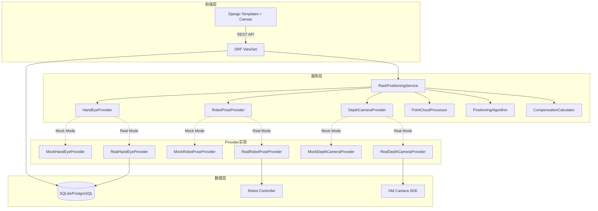

# 设计文档：3D深度相机料架定位系统

## Overview

本设计文档描述了3D深度相机料架定位系统的技术架构、模块设计和实现细节。该系统基于Django框架，使用Open3D和NumPy进行点云处理，通过手眼标定实现相机坐标到机器人坐标的转换，并采用RANSAC、边缘检测等算法提取料架刚性基准，计算三轴补偿值供机器人精确装箱。

### 核心业务流程

```
料架到位 → 定位机构夹紧 → PLC判断层号 → 机器人移动到拍照位 
→ 3D相机采集点云 → 相机坐标转机器人坐标 → 裁剪ROI 
→ 提取刚性基准（支撑面/前边缘/立柱） → 计算X/Y/Z补偿 → 写入PLC 
→ 机器人使用补偿装箱 → 重复下一层
```

### 设计目标

1. **模块化架构**：通过Provider模式解耦数据来源，支持Mock/Real双模式
2. **可扩展性**：支持不同料架类型、多种ROI配置和算法策略
3. **可测试性**：完整的模拟数据生成，无需真实硬件即可开发测试
4. **可追溯性**：保存完整的点云数据、计算过程和结果
5. **高性能**：单层定位计算在2-5秒内完成
6. **可配置性**：通过配方系统灵活配置ROI、阈值和算法参数

### 技术栈

- **后端框架**：Django 4.x + Django REST Framework
- **数据库**：SQLite（开发/Demo）/ PostgreSQL（生产）
- **点云处理**：Open3D 0.18+ （可视化、RANSAC平面拟合、滤波）
- **数值计算**：NumPy 1.24+, SciPy 1.10+
- **图像处理**：OpenCV 4.8+ （深度图可视化、边缘检测）
- **3D相机SDK**：dm_camera模块（已封装DM相机SDK）
- **前端**：Django Templates + Canvas（点云投影渲染）
- **坐标单位**：毫米（mm）

## Architecture

### 系统架构图



### 分层架构

**表现层（Presentation Layer）**
- Django Templates：渲染前端页面
- Canvas：点云投影可视化、ROI绘制
- REST API：前后端JSON数据交互

**服务层（Service Layer）**
- `RackPositioningService`：主服务，协调各模块完成定位流程
- `PointCloudProcessor`：点云坐标转换、ROI裁剪、滤波
- `PositioningAlgorithm`：Z/Y/X轴定位算法（平面拟合、边缘检测、立柱检测）
- `CompensationCalculator`：补偿值计算

**Provider层（Data Provider Layer）**
- 手眼标定Provider：提供T_flange_camera矩阵
- 机器人位姿Provider：提供T_base_flange矩阵
- 深度相机Provider：提供点云数据

**数据访问层（Data Access Layer）**
- Django ORM：操作RackLocationRecipe、RackLocationROI3D、RackLocationResult等模型
- dm_camera SDK：3D相机硬件通讯

## Components and Interfaces

### 1. Provider设计模式

Provider模式用于抽象数据来源，支持Mock/Real双模式切换。每个Provider定义清晰的接口，具体实现类负责提供数据。

#### 1.1 HandEyeProvider

**接口定义**

```python
from abc import ABC, abstractmethod
import numpy as np

class HandEyeProvider(ABC):
    """手眼标定数据提供者接口"""
    
    @abstractmethod
    def get_hand_eye_matrix(self, recipe_id: int = None) -> np.ndarray:
        """获取手眼标定矩阵 T_flange_camera (4x4)
        
        Args:
            recipe_id: 配方ID，用于查询关联的标定矩阵
            
        Returns:
            4x4 numpy array，齐次变换矩阵
        """
        pass
    
    @abstractmethod
    def save_hand_eye_matrix(self, matrix: np.ndarray, recipe_id: int = None) -> None:
        """保存手眼标定矩阵
        
        Args:
            matrix: 4x4手眼标定矩阵
            recipe_id: 关联的配方ID
        """
        pass
```

**MockHandEyeProvider实现**

```python
class MockHandEyeProvider(HandEyeProvider):
    """模拟手眼标定Provider，用于开发测试"""
    
    def __init__(self):
        # 模拟手眼标定矩阵：相机相对法兰的固定关系
        # 相机位置：前方120mm，下方60mm，右侧30mm，无旋转
        self._mock_matrix = np.array([
            [1, 0, 0,  30],   # X: 向右30mm
            [0, 1, 0, -60],   # Y: 向下60mm
            [0, 0, 1, 120],   # Z: 向前120mm
            [0, 0, 0,   1]
        ], dtype=np.float64)
    
    def get_hand_eye_matrix(self, recipe_id: int = None) -> np.ndarray:
        logger.info("[MOCK] 返回模拟手眼标定矩阵")
        return self._mock_matrix.copy()
    
    def save_hand_eye_matrix(self, matrix: np.ndarray, recipe_id: int = None) -> None:
        logger.info("[MOCK] 保存手眼标定矩阵（仅记录日志）")
```

**RealHandEyeProvider实现**

```python
class RealHandEyeProvider(HandEyeProvider):
    """真实手眼标定Provider，从数据库或配置文件读取"""
    
    def get_hand_eye_matrix(self, recipe_id: int = None) -> np.ndarray:
        if recipe_id:
            recipe = RackLocationRecipe.objects.get(id=recipe_id)
            hand_eye_config = recipe.hand_eye_config
        else:
            # 使用激活配方的手眼标定
            recipe = RackLocationRecipe.objects.filter(enabled=True).first()
            if not recipe:
                raise ValueError("未找到激活的料架定位配方")
            hand_eye_config = recipe.hand_eye_config
        
        if 'T_flange_camera' not in hand_eye_config:
            raise ValueError("配方中未配置手眼标定矩阵")
        
        # hand_eye_config['T_flange_camera'] 存储为嵌套列表
        matrix = np.array(hand_eye_config['T_flange_camera'], dtype=np.float64)
        if matrix.shape != (4, 4):
            raise ValueError(f"手眼标定矩阵维度错误: {matrix.shape}")
        
        return matrix
    
    def save_hand_eye_matrix(self, matrix: np.ndarray, recipe_id: int = None) -> None:
        if recipe_id is None:
            raise ValueError("保存手眼标定矩阵时必须指定recipe_id")
        
        recipe = RackLocationRecipe.objects.get(id=recipe_id)
        recipe.hand_eye_config['T_flange_camera'] = matrix.tolist()
        recipe.save(update_fields=['hand_eye_config', 'updated_at'])
```

#### 1.2 RobotPoseProvider

**接口定义**

```python
class RobotPoseProvider(ABC):
    """机器人位姿数据提供者接口"""
    
    @abstractmethod
    def get_robot_pose_matrix(self, layer_no: int, recipe_id: int = None) -> np.ndarray:
        """获取机器人当前位姿矩阵 T_base_flange (4x4)
        
        Args:
            layer_no: 料架层号（1, 2, 3）
            recipe_id: 配方ID，用于查询预设拍照位
            
        Returns:
            4x4 numpy array，齐次变换矩阵
        """
        pass
    
    @abstractmethod
    def get_robot_pose_dict(self, layer_no: int, recipe_id: int = None) -> dict:
        """获取机器人位姿字典（X, Y, Z, RX, RY, RZ）
        
        Returns:
            dict: {'X': float, 'Y': float, 'Z': float, 
                   'RX': float, 'RY': float, 'RZ': float}
        """
        pass
```

**MockRobotPoseProvider实现**

```python
class MockRobotPoseProvider(RobotPoseProvider):
    """模拟机器人位姿Provider"""
    
    def __init__(self):
        # 预设三层拍照位（单位：毫米和度）
        self._mock_poses = {
            1: {'X': 1000, 'Y': 500, 'Z': 600, 'RX': 0, 'RY': 0, 'RZ': 0},
            2: {'X': 1000, 'Y': 500, 'Z': 900, 'RX': 0, 'RY': 0, 'RZ': 0},
            3: {'X': 1000, 'Y': 500, 'Z': 1200, 'RX': 0, 'RY': 0, 'RZ': 0},
        }
    
    def get_robot_pose_dict(self, layer_no: int, recipe_id: int = None) -> dict:
        if layer_no not in self._mock_poses:
            raise ValueError(f"不支持的层号: {layer_no}")
        logger.info(f"[MOCK] 返回第{layer_no}层模拟机器人位姿")
        return self._mock_poses[layer_no].copy()
    
    def get_robot_pose_matrix(self, layer_no: int, recipe_id: int = None) -> np.ndarray:
        pose = self.get_robot_pose_dict(layer_no, recipe_id)
        # 简化：假设无旋转，只有平移
        matrix = np.eye(4, dtype=np.float64)
        matrix[0, 3] = pose['X']
        matrix[1, 3] = pose['Y']
        matrix[2, 3] = pose['Z']
        # TODO: 如果RX/RY/RZ非零，需要计算旋转矩阵
        return matrix
```

**RealRobotPoseProvider实现**

```python
class RealRobotPoseProvider(RobotPoseProvider):
    """真实机器人位姿Provider，从机器人控制器读取"""
    
    def __init__(self, robot_service):
        self.robot_service = robot_service  # RobotService实例
    
    def get_robot_pose_dict(self, layer_no: int, recipe_id: int = None) -> dict:
        # 从机器人控制器读取当前TCP位姿
        pose = self.robot_service.get_tcp_pose()
        return {
            'X': pose.x,
            'Y': pose.y,
            'Z': pose.z,
            'RX': pose.rx,
            'RY': pose.ry,
            'RZ': pose.rz,
        }
    
    def get_robot_pose_matrix(self, layer_no: int, recipe_id: int = None) -> np.ndarray:
        pose = self.get_robot_pose_dict(layer_no, recipe_id)
        # 使用scipy计算旋转矩阵
        from scipy.spatial.transform import Rotation
        
        # 构建齐次变换矩阵
        matrix = np.eye(4, dtype=np.float64)
        matrix[0, 3] = pose['X']
        matrix[1, 3] = pose['Y']
        matrix[2, 3] = pose['Z']
        
        # 旋转部分（欧拉角 -> 旋转矩阵）
        r = Rotation.from_euler('xyz', [pose['RX'], pose['RY'], pose['RZ']], degrees=True)
        matrix[:3, :3] = r.as_matrix()
        
        return matrix
```

#### 1.3 DepthCameraProvider

**接口定义**

```python
class DepthCameraProvider(ABC):
    """深度相机数据提供者接口"""
    
    @abstractmethod
    def capture_pointcloud(self, recipe_id: int = None) -> dict:
        """采集点云数据
        
        Args:
            recipe_id: 配方ID，用于查询相机配置
            
        Returns:
            dict: {
                'data': np.ndarray (H x W x 3 或 N x 3),
                'width': int,
                'height': int,
                'frame_index': int,
                'confidence': float,
                'raw_data_path': str,
                'result_image_path': str,
            }
        """
        pass
```

**MockDepthCameraProvider实现**

```python
class MockDepthCameraProvider(DepthCameraProvider):
    """模拟深度相机Provider，生成测试点云"""
    
    def capture_pointcloud(self, recipe_id: int = None) -> dict:
        logger.info("[MOCK] 生成模拟点云数据")
        
        # 生成模拟点云：支撑面 + 立柱 + 边缘 + 噪声
        # 相机坐标系：Z轴向前，X轴向右，Y轴向下
        
        # 支撑面点（平面）
        x_support = np.linspace(-200, 200, 50)
        y_support = np.linspace(-100, 100, 25)
        xx, yy = np.meshgrid(x_support, y_support)
        zz = np.full_like(xx, 810.0)  # 第2层支撑面，Z=810mm
        
        # 添加小幅噪声
        zz += np.random.normal(0, 2, zz.shape)
        
        support_points = np.column_stack([xx.ravel(), yy.ravel(), zz.ravel()])
        
        # 立柱点（垂直线）
        z_pillar = np.linspace(700, 900, 30)
        x_left = np.full_like(z_pillar, -180.0)
        y_pillar = np.random.uniform(-50, 50, len(z_pillar))
        pillar_points = np.column_stack([x_left, y_pillar, z_pillar])
        
        # 前边缘点（水平线）
        x_edge = np.linspace(-200, 200, 40)
        y_edge = np.full_like(x_edge, 95.0)
        z_edge = np.full_like(x_edge, 810.0)
        edge_points = np.column_stack([x_edge, y_edge, z_edge])
        
        # 合并所有点
        pointcloud = np.vstack([support_points, pillar_points, edge_points])
        
        # 添加随机噪声点
        noise_count = 100
        noise_points = np.random.uniform([-250, -150, 600], [250, 150, 1000], (noise_count, 3))
        pointcloud = np.vstack([pointcloud, noise_points])
        
        # 模拟组织化点云（H x W x 3）
        height, width = 120, 160
        organized_cloud = np.zeros((height, width, 3), dtype=np.float32)
        
        # 将非组织化点云映射到组织化结构
        for i, pt in enumerate(pointcloud):
            if i >= height * width:
                break
            row = i // width
            col = i % width
            organized_cloud[row, col] = pt
        
        return {
            'data': organized_cloud,
            'width': width,
            'height': height,
            'frame_index': np.random.randint(1000, 9999),
            'confidence': 0.95,
            'raw_data_path': '/mock/pointcloud_raw.npy',
            'result_image_path': '/mock/pointcloud_preview.png',
        }
```

**RealDepthCameraProvider实现**

```python
class RealDepthCameraProvider(DepthCameraProvider):
    """真实深度相机Provider，调用dm_camera模块"""
    
    def __init__(self, dm_camera_service):
        self.dm_camera_service = dm_camera_service  # DMCameraService实例
    
    def capture_pointcloud(self, recipe_id: int = None) -> dict:
        # 确保相机已连接和流已开启
        if not self.dm_camera_service.is_streaming:
            raise RuntimeError("相机数据流未开启")
        
        # 调用dm_camera服务采集点云
        frame_data = self.dm_camera_service.capture_frame_data(
            frame_type='POINTCLOUD',
            save_record=True
        )
        
        # 转换数据格式
        return {
            'data': frame_data['data'],  # numpy array
            'width': frame_data['width'],
            'height': frame_data['height'],
            'frame_index': frame_data['frame_index'],
            'confidence': frame_data.get('confidence', 0.9),
            'raw_data_path': frame_data.get('raw_data_path', ''),
            'result_image_path': frame_data.get('result_image_path', ''),
        }
```

#### 1.4 Provider工厂

```python
class ProviderFactory:
    """Provider工厂，根据配置创建对应实现"""
    
    @staticmethod
    def create_hand_eye_provider(mode: str) -> HandEyeProvider:
        if mode == 'MOCK':
            return MockHandEyeProvider()
        elif mode == 'REAL':
            return RealHandEyeProvider()
        else:
            raise ValueError(f"不支持的模式: {mode}")
    
    @staticmethod
    def create_robot_pose_provider(mode: str, **kwargs) -> RobotPoseProvider:
        if mode == 'MOCK':
            return MockRobotPoseProvider()
        elif mode == 'REAL':
            robot_service = kwargs.get('robot_service')
            if not robot_service:
                raise ValueError("Real模式需要提供robot_service")
            return RealRobotPoseProvider(robot_service)
        else:
            raise ValueError(f"不支持的模式: {mode}")
    
    @staticmethod
    def create_depth_camera_provider(mode: str, **kwargs) -> DepthCameraProvider:
        if mode == 'MOCK':
            return MockDepthCameraProvider()
        elif mode == 'REAL':
            dm_camera_service = kwargs.get('dm_camera_service')
            if not dm_camera_service:
                raise ValueError("Real模式需要提供dm_camera_service")
            return RealDepthCameraProvider(dm_camera_service)
        else:
            raise ValueError(f"不支持的模式: {mode}")
```

### 2. 点云处理模块

#### 2.1 PointCloudProcessor

```python
class PointCloudProcessor:
    """点云处理器：坐标转换、ROI裁剪、滤波"""
    
    def transform_to_robot_coords(self, 
                                   pointcloud: np.ndarray,
                                   T_flange_camera: np.ndarray,
                                   T_base_flange: np.ndarray) -> np.ndarray:
        """将相机坐标系点云转换到机器人基坐标系
        
        公式：P_base = T_base_flange @ T_flange_camera @ P_camera
        
        Args:
            pointcloud: 相机坐标系点云 (N x 3 或 H x W x 3)
            T_flange_camera: 手眼标定矩阵 (4x4)
            T_base_flange: 机器人位姿矩阵 (4x4)
            
        Returns:
            机器人坐标系点云 (N x 3)
        """
        # 展平为 N x 3
        original_shape = pointcloud.shape
        if len(original_shape) == 3:  # H x W x 3
            pointcloud = pointcloud.reshape(-1, 3)
        
        # 过滤无效点（深度为0或NaN）
        valid_mask = ~np.isnan(pointcloud).any(axis=1) & (np.abs(pointcloud).sum(axis=1) > 1e-6)
        valid_points = pointcloud[valid_mask]
        
        if len(valid_points) == 0:
            return np.array([]).reshape(0, 3)
        
        # 转换为齐次坐标 (N x 4)
        ones = np.ones((len(valid_points), 1))
        points_homo = np.hstack([valid_points, ones])
        
        # 链式变换
        T_combined = T_base_flange @ T_flange_camera
        points_robot_homo = (T_combined @ points_homo.T).T
        
        # 转回笛卡尔坐标
        points_robot = points_robot_homo[:, :3]
        
        return points_robot
    
    def crop_roi(self, pointcloud: np.ndarray, roi_bounds: dict) -> np.ndarray:
        """裁剪ROI区域点云
        
        Args:
            pointcloud: 机器人坐标系点云 (N x 3)
            roi_bounds: {'x_min', 'x_max', 'y_min', 'y_max', 'z_min', 'z_max'}
            
        Returns:
            裁剪后的点云 (M x 3, M <= N)
        """
        if len(pointcloud) == 0:
            return pointcloud
        
        # 应用ROI边界条件
        mask = (
            (pointcloud[:, 0] >= roi_bounds['x_min']) &
            (pointcloud[:, 0] <= roi_bounds['x_max']) &
            (pointcloud[:, 1] >= roi_bounds['y_min']) &
            (pointcloud[:, 1] <= roi_bounds['y_max']) &
            (pointcloud[:, 2] >= roi_bounds['z_min']) &
            (pointcloud[:, 2] <= roi_bounds['z_max'])
        )
        
        cropped = pointcloud[mask]
        logger.info(f"ROI裁剪：{len(pointcloud)} -> {len(cropped)} 点")
        
        return cropped
    
    def filter_outliers(self, pointcloud: np.ndarray, 
                        nb_neighbors: int = 20, 
                        std_ratio: float = 2.0) -> np.ndarray:
        """统计离群点滤波
        
        Args:
            pointcloud: 点云 (N x 3)
            nb_neighbors: 近邻点数
            std_ratio: 标准差倍数
            
        Returns:
            滤波后的点云
        """
        import open3d as o3d
        
        if len(pointcloud) < nb_neighbors:
            return pointcloud
        
        pcd = o3d.geometry.PointCloud()
        pcd.points = o3d.utility.Vector3dVector(pointcloud)
        
        cl, ind = pcd.remove_statistical_outlier(nb_neighbors, std_ratio)
        filtered = np.asarray(cl.points)
        
        logger.info(f"离群点滤波：{len(pointcloud)} -> {len(filtered)} 点")
        return filtered
    
    def downsample(self, pointcloud: np.ndarray, voxel_size: float = 5.0) -> np.ndarray:
        """体素下采样
        
        Args:
            pointcloud: 点云 (N x 3)
            voxel_size: 体素大小（毫米）
            
        Returns:
            下采样后的点云
        """
        import open3d as o3d
        
        pcd = o3d.geometry.PointCloud()
        pcd.points = o3d.utility.Vector3dVector(pointcloud)
        
        downsampled_pcd = pcd.voxel_down_sample(voxel_size)
        downsampled = np.asarray(downsampled_pcd.points)
        
        logger.info(f"体素下采样：{len(pointcloud)} -> {len(downsampled)} 点")
        return downsampled
```

### 3. 定位算法模块

#### 3.1 PositioningAlgorithm

```python
class PositioningAlgorithm:
    """料架定位算法：Z轴（支撑面）、Y轴（前边缘）、X轴（立柱）"""
    
    def detect_z_axis(self, support_roi_points: np.ndarray, 
                      ransac_threshold: float = 5.0) -> dict:
        """Z轴定位：通过RANSAC平面拟合检测支撑面高度
        
        Args:
            support_roi_points: 支撑面ROI点云 (N x 3)
            ransac_threshold: RANSAC距离阈值（毫米）
            
        Returns:
            dict: {
                'z_actual': float,  # 实际Z坐标（毫米）
                'plane_model': list,  # 平面方程 [a, b, c, d]
                'inlier_count': int,  # 内点数量
                'confidence': float,  # 置信度 [0, 1]
            }
        """
        import open3d as o3d
        
        if len(support_roi_points) < 10:
            raise ValueError(f"支撑面ROI点数不足: {len(support_roi_points)}")
        
        # 使用Open3D的RANSAC平面拟合
        pcd = o3d.geometry.PointCloud()
        pcd.points = o3d.utility.Vector3dVector(support_roi_points)
        
        plane_model, inliers = pcd.segment_plane(
            distance_threshold=ransac_threshold,
            ransac_n=3,
            num_iterations=1000
        )
        
        [a, b, c, d] = plane_model
        inlier_points = support_roi_points[inliers]
        
        # 计算平面平均高度（Z坐标）
        z_actual = np.mean(inlier_points[:, 2])
        
        # 置信度：内点比例
        confidence = len(inliers) / len(support_roi_points)
        
        logger.info(f"Z轴检测：平面模型={plane_model}, Z={z_actual:.3f}, 置信度={confidence:.3f}")
        
        return {
            'z_actual': float(z_actual),
            'plane_model': plane_model.tolist(),
            'inlier_count': len(inliers),
            'confidence': float(confidence),
        }

    
    def detect_y_axis(self, edge_roi_points: np.ndarray) -> dict:
        """Y轴定位：通过边缘检测识别前边缘位置
        
        Args:
            edge_roi_points: 前边缘ROI点云 (N x 3)
            
        Returns:
            dict: {
                'y_actual': float,  # 实际Y坐标（毫米）
                'edge_points_count': int,  # 边缘点数量
                'confidence': float,  # 置信度 [0, 1]
            }
        """
        if len(edge_roi_points) < 5:
            raise ValueError(f"前边缘ROI点数不足: {len(edge_roi_points)}")
        
        # 计算Y坐标的中位数作为前边缘位置
        y_coords = edge_roi_points[:, 1]
        y_actual = np.median(y_coords)
        
        # 置信度：基于Y坐标的标准差（越小越好）
        y_std = np.std(y_coords)
        confidence = 1.0 / (1.0 + y_std / 10.0)  # 归一化到[0, 1]
        
        logger.info(f"Y轴检测：Y={y_actual:.3f}, 标准差={y_std:.3f}, 置信度={confidence:.3f}")
        
        return {
            'y_actual': float(y_actual),
            'edge_points_count': len(edge_roi_points),
            'confidence': float(confidence),
        }
    
    def detect_x_axis(self, pillar_roi_points: np.ndarray) -> dict:
        """X轴定位：通过立柱检测识别侧边位置
        
        Args:
            pillar_roi_points: 立柱ROI点云 (N x 3)
            
        Returns:
            dict: {
                'x_actual': float,  # 实际X坐标（毫米）
                'pillar_points_count': int,  # 立柱点数量
                'confidence': float,  # 置信度 [0, 1]
            }
        """
        if len(pillar_roi_points) < 5:
            raise ValueError(f"立柱ROI点数不足: {len(pillar_roi_points)}")
        
        # 计算X坐标的中位数作为立柱位置
        x_coords = pillar_roi_points[:, 0]
        x_actual = np.median(x_coords)
        
        # 置信度：基于X坐标的标准差
        x_std = np.std(x_coords)
        confidence = 1.0 / (1.0 + x_std / 10.0)
        
        logger.info(f"X轴检测：X={x_actual:.3f}, 标准差={x_std:.3f}, 置信度={confidence:.3f}")
        
        return {
            'x_actual': float(x_actual),
            'pillar_points_count': len(pillar_roi_points),
            'confidence': float(confidence),
        }
```

### 4. 补偿计算模块

#### 4.1 CompensationCalculator

```python
class CompensationCalculator:
    """补偿值计算器：计算实际值与理论值的差异"""
    
    def calculate_offsets(self, 
                          actual_x: float, actual_y: float, actual_z: float,
                          standard_x: float, standard_y: float, standard_z: float) -> dict:
        """计算三轴补偿值
        
        Args:
            actual_x, actual_y, actual_z: 实际测量的三维坐标
            standard_x, standard_y, standard_z: 配方中的理论坐标
            
        Returns:
            dict: {
                'offset_x': float,  # X轴补偿（毫米）
                'offset_y': float,  # Y轴补偿（毫米）
                'offset_z': float,  # Z轴补偿（毫米）
            }
        """
        offset_x = actual_x - standard_x
        offset_y = actual_y - standard_y
        offset_z = actual_z - standard_z
        
        logger.info(f"补偿计算：ΔX={offset_x:.3f}, ΔY={offset_y:.3f}, ΔZ={offset_z:.3f}")
        
        return {
            'offset_x': float(offset_x),
            'offset_y': float(offset_y),
            'offset_z': float(offset_z),
        }
    
    def validate_offsets(self, 
                         offset_x: float, offset_y: float, offset_z: float,
                         max_offset_x: float, max_offset_y: float, max_offset_z: float) -> bool:
        """验证补偿值是否在允许范围内
        
        Args:
            offset_x, offset_y, offset_z: 计算的补偿值
            max_offset_x, max_offset_y, max_offset_z: 配方中的最大允许偏移
            
        Returns:
            bool: True表示补偿值在范围内，False表示超出范围
        """
        in_range = (
            abs(offset_x) <= max_offset_x and
            abs(offset_y) <= max_offset_y and
            abs(offset_z) <= max_offset_z
        )
        
        if not in_range:
            logger.warning(
                f"补偿值超出范围：ΔX={offset_x:.3f}(max={max_offset_x}), "
                f"ΔY={offset_y:.3f}(max={max_offset_y}), "
                f"ΔZ={offset_z:.3f}(max={max_offset_z})"
            )
        
        return in_range
```


### 5. 主服务协调器

#### 5.1 RackPositioningService

```python
class RackPositioningService:
    """料架3D定位主服务：协调各模块完成完整定位流程"""
    
    def __init__(self, mode: str = 'MOCK'):
        """初始化服务
        
        Args:
            mode: 运行模式 ('MOCK' 或 'REAL')
        """
        self.mode = mode
        self.hand_eye_provider = ProviderFactory.create_hand_eye_provider(mode)
        self.robot_pose_provider = ProviderFactory.create_robot_pose_provider(mode)
        self.depth_camera_provider = ProviderFactory.create_depth_camera_provider(mode)
        self.processor = PointCloudProcessor()
        self.algorithm = PositioningAlgorithm()
        self.calculator = CompensationCalculator()
    
    def execute_positioning(self, recipe_id: int, layer_no: int) -> dict:
        """执行完整的料架定位流程
        
        Args:
            recipe_id: 配方ID
            layer_no: 料架层号 (1, 2, 3)
            
        Returns:
            dict: 定位结果，包含实际坐标、补偿值、置信度等
        """
        try:
            # 1. 加载配方
            recipe = RackLocationRecipe.objects.get(id=recipe_id, enabled=True)
            
            # 2. 采集点云
            logger.info(f"[{self.mode}] 采集第{layer_no}层点云...")
            pointcloud_data = self.depth_camera_provider.capture_pointcloud(recipe_id)
            
            # 3. 获取手眼标定矩阵和机器人位姿
            T_flange_camera = self.hand_eye_provider.get_hand_eye_matrix(recipe_id)
            T_base_flange = self.robot_pose_provider.get_robot_pose_matrix(layer_no, recipe_id)
            
            # 4. 坐标转换：相机坐标 -> 机器人坐标
            logger.info(f"坐标转换：相机 -> 机器人基坐标系")
            pointcloud_robot = self.processor.transform_to_robot_coords(
                pointcloud_data['data'],
                T_flange_camera,
                T_base_flange
            )
            
            # 5. 加载ROI配置并裁剪
            rois = self._load_rois(recipe_id, layer_no)
            roi_crops = self._crop_all_rois(pointcloud_robot, rois)
            
            # 6. 执行三轴定位
            z_result = self.algorithm.detect_z_axis(roi_crops['support'])
            y_result = self.algorithm.detect_y_axis(roi_crops['edge'])
            x_result = self.algorithm.detect_x_axis(roi_crops['pillar'])
            
            # 7. 计算补偿值
            offsets = self.calculator.calculate_offsets(
                x_result['x_actual'], y_result['y_actual'], z_result['z_actual'],
                float(recipe.standard_x), float(recipe.standard_y), float(recipe.standard_z)
            )
            
            # 8. 验证补偿值范围
            is_valid = self.calculator.validate_offsets(
                offsets['offset_x'], offsets['offset_y'], offsets['offset_z'],
                float(recipe.max_offset_x), float(recipe.max_offset_y), float(recipe.max_offset_z)
            )
            
            # 9. 计算综合置信度
            confidence = min(z_result['confidence'], y_result['confidence'], x_result['confidence'])
            is_success = is_valid and confidence >= float(recipe.confidence_threshold)
            
            # 10. 保存结果
            result = self._save_result(recipe, layer_no, {
                'actual_x': x_result['x_actual'],
                'actual_y': y_result['y_actual'],
                'actual_z': z_result['z_actual'],
                **offsets,
                'confidence': confidence,
                'is_success': is_success,
                'raw_data_path': pointcloud_data.get('raw_data_path', ''),
                'result_image_path': pointcloud_data.get('result_image_path', ''),
                'algorithm_details': {
                    'z_detection': z_result,
                    'y_detection': y_result,
                    'x_detection': x_result,
                }
            })
            
            logger.info(f"定位完成：success={is_success}, confidence={confidence:.3f}")
            return result
            
        except Exception as e:
            logger.error(f"定位失败: {str(e)}", exc_info=True)
            raise
    
    def _load_rois(self, recipe_id: int, layer_no: int) -> dict:
        """加载当前层的ROI配置"""
        rois = RackLocationROI3D.objects.filter(
            recipe_id=recipe_id,
            layer_no=layer_no,
            enabled=True
        )
        
        roi_dict = {}
        for roi in rois:
            roi_dict[roi.roi_name] = {
                'x_min': float(roi.x_min),
                'x_max': float(roi.x_max),
                'y_min': float(roi.y_min),
                'y_max': float(roi.y_max),
                'z_min': float(roi.z_min),
                'z_max': float(roi.z_max),
            }
        
        return roi_dict
    
    def _crop_all_rois(self, pointcloud: np.ndarray, rois: dict) -> dict:
        """裁剪所有ROI区域"""
        crops = {}
        for roi_name, roi_bounds in rois.items():
            cropped = self.processor.crop_roi(pointcloud, roi_bounds)
            # 可选：滤波和下采样
            if len(cropped) > 1000:
                cropped = self.processor.downsample(cropped, voxel_size=5.0)
            if len(cropped) > 50:
                cropped = self.processor.filter_outliers(cropped)
            crops[roi_name] = cropped
        
        return crops
    
    def _save_result(self, recipe, layer_no: int, result_data: dict):
        """保存定位结果到数据库"""
        # 创建或获取VisionTask
        from apps.vision.models import VisionTask, RackLocationResult
        task = VisionTask.objects.create(
            task_type='RACK_3D_POSITIONING',
            status='SUCCESS' if result_data['is_success'] else 'FAILED'
        )
        
        # 创建结果记录
        result = RackLocationResult.objects.create(
            vision_task=task,
            recipe=recipe,
            position_no=recipe.position_no,
            layer_no=layer_no,
            actual_x=result_data['actual_x'],
            actual_y=result_data['actual_y'],
            actual_z=result_data['actual_z'],
            offset_x=result_data['offset_x'],
            offset_y=result_data['offset_y'],
            offset_z=result_data['offset_z'],
            confidence=result_data['confidence'],
            is_success=result_data['is_success'],
            raw_data_path=result_data.get('raw_data_path', ''),
            result_image_path=result_data.get('result_image_path', ''),
            result_data=result_data.get('algorithm_details', {}),
        )
        
        return {
            'task_id': task.id,
            'result_id': result.id,
            **result_data
        }
```

## Data Models

### 数据库模型设计

系统复用现有的vision应用模型，通过JSONField存储扩展配置。

#### RackLocationRecipe（料架定位配方）

```python
class RackLocationRecipe(TimeStampedModel):
    # 基础信息
    recipe_name = models.CharField(max_length=128, unique=True)
    rack_type = models.CharField(max_length=64, blank=True)
    position_no = models.PositiveIntegerField(default=1, db_index=True)
    layer_no = models.PositiveIntegerField(default=1, db_index=True)
    
    # 理论坐标（毫米，精度0.001）
    standard_x = models.DecimalField(max_digits=10, decimal_places=3, default=0)
    standard_y = models.DecimalField(max_digits=10, decimal_places=3, default=0)
    standard_z = models.DecimalField(max_digits=10, decimal_places=3, default=0)
    
    # 手眼标定配置（JSONField）
    # 存储格式：{'T_flange_camera': [[...], [...], [...], [...]]}
    hand_eye_config = models.JSONField(default=dict, blank=True)
    
    # 基准特征配置（JSONField）
    # 存储算法参数：{'ransac_threshold': 5.0, 'min_points': 10, ...}
    reference_feature_config = models.JSONField(default=dict, blank=True)
    
    # 最大允许偏移（毫米）
    max_offset_x = models.DecimalField(max_digits=10, decimal_places=3, default=10)
    max_offset_y = models.DecimalField(max_digits=10, decimal_places=3, default=10)
    max_offset_z = models.DecimalField(max_digits=10, decimal_places=3, default=10)
    
    # 置信度阈值
    confidence_threshold = models.DecimalField(max_digits=5, decimal_places=4, default=0.7000)
    
    enabled = models.BooleanField(default=True)
```


#### RackLocationROI3D（3D ROI配置）

```python
class RackLocationROI3D(TimeStampedModel):
    recipe = models.ForeignKey(RackLocationRecipe, on_delete=models.CASCADE, related_name='rois_3d')
    roi_name = models.CharField(max_length=128)  # 'support', 'edge', 'pillar', 'main'
    layer_no = models.PositiveIntegerField(db_index=True)  # 1, 2, 3
    
    # ROI边界（机器人基坐标系，毫米）
    x_min = models.DecimalField(max_digits=10, decimal_places=3)
    x_max = models.DecimalField(max_digits=10, decimal_places=3)
    y_min = models.DecimalField(max_digits=10, decimal_places=3)
    y_max = models.DecimalField(max_digits=10, decimal_places=3)
    z_min = models.DecimalField(max_digits=10, decimal_places=3)
    z_max = models.DecimalField(max_digits=10, decimal_places=3)
    
    enabled = models.BooleanField(default=True)
    
    class Meta:
        constraints = [
            models.CheckConstraint(
                condition=models.Q(x_min__lt=models.F('x_max')),
                name='rack_3d_roi_x_min_lt_x_max'
            ),
            models.CheckConstraint(
                condition=models.Q(y_min__lt=models.F('y_max')),
                name='rack_3d_roi_y_min_lt_y_max'
            ),
            models.CheckConstraint(
                condition=models.Q(z_min__lt=models.F('z_max')),
                name='rack_3d_roi_z_min_lt_z_max'
            ),
        ]
```

#### RackLocationResult（定位结果）

```python
class RackLocationResult(TimeStampedModel):
    vision_task = models.ForeignKey(VisionTask, on_delete=models.CASCADE, related_name='rack_results')
    recipe = models.ForeignKey(RackLocationRecipe, null=True, on_delete=models.SET_NULL, related_name='results')
    
    # 层号和位置
    position_no = models.PositiveIntegerField(default=1, db_index=True)
    layer_no = models.PositiveIntegerField(default=1, db_index=True)
    
    # 实际测量坐标（毫米）
    actual_x = models.DecimalField(max_digits=10, decimal_places=3, default=0)
    actual_y = models.DecimalField(max_digits=10, decimal_places=3, default=0)
    actual_z = models.DecimalField(max_digits=10, decimal_places=3, default=0)
    
    # 补偿值（毫米）
    offset_x = models.DecimalField(max_digits=10, decimal_places=3, default=0)
    offset_y = models.DecimalField(max_digits=10, decimal_places=3, default=0)
    offset_z = models.DecimalField(max_digits=10, decimal_places=3, default=0)
    
    # 置信度和状态
    confidence = models.DecimalField(max_digits=5, decimal_places=4, default=0)
    is_success = models.BooleanField(default=False)
    
    # 数据路径
    raw_data_path = models.CharField(max_length=512, blank=True)  # 原始点云.npy文件
    result_image_path = models.CharField(max_length=512, blank=True)  # 结果可视化图像
    
    # 算法详情（JSONField）
    # 存储：{'z_detection': {...}, 'y_detection': {...}, 'x_detection': {...}}
    result_data = models.JSONField(default=dict, blank=True)
    
    # 错误信息
    error_code = models.CharField(max_length=64, blank=True)
    error_message = models.TextField(blank=True)
```

## Correctness Properties

*属性是一种特征或行为,应该在系统的所有有效执行中保持为真——本质上是对系统应该做什么的形式化陈述。属性充当人类可读规范和机器可验证正确性保证之间的桥梁。*

基于prework分析,本系统的核心算法和数学运算适合使用property-based testing。以下属性应该对所有有效输入成立:

### Property 1: 坐标转换保持可逆性

*For any* 点云坐标P、手眼矩阵T_flange_camera和机器人位姿T_base_flange,如果将点云从相机坐标转换到机器人坐标,然后应用逆变换,应该得到原始坐标(在数值精度范围内)。

**Validates: Requirements 2.1, 2.2, 2.3**

### Property 2: 坐标转换保持向量关系

*For any* 两个点P1和P2在相机坐标系下,它们之间的欧氏距离在转换到机器人坐标系后应该保持不变(刚体变换保持距离不变性)。

**Validates: Requirements 2.1**

### Property 3: ROI裁剪正确性

*For any* 点云和ROI边界,裁剪后的所有点都应该满足:
- x_min <= x <= x_max
- y_min <= y <= y_max  
- z_min <= z <= z_max

**Validates: Requirements 4.1, 4.2, 4.3, 4.4**

### Property 4: 无效点过滤完整性

*For any* 包含NaN、零值或inf的点云,过滤后的点云不应该包含任何这些无效值。

**Validates: Requirements 4.5, 4.6**

### Property 5: 补偿值计算正确性

*For any* 实际坐标(actual_x, actual_y, actual_z)和理论坐标(standard_x, standard_y, standard_z),补偿值应该满足:
- offset_x = actual_x - standard_x
- offset_y = actual_y - standard_y
- offset_z = actual_z - standard_z

**Validates: Requirements 9.2, 9.3, 9.4**

### Property 6: ROI边界有效性

*For any* ROI配置,系统应该拒绝任何 min >= max 的边界配置:
- x_min < x_max
- y_min < y_max
- z_min < z_max

**Validates: Requirements 3.4**


### Property 7: 手眼矩阵不变性

*For any* 配方ID,在没有显式更新的情况下,多次获取手眼标定矩阵应该返回相同的矩阵(逐元素相等)。

**Validates: Requirements 2.4**

### Property 8: 平面拟合有效性

*For any* 包含至少10个共面点(带小幅噪声)的点云,RANSAC平面拟合应该成功返回平面方程,且内点比例 > 0.5。

**Validates: Requirements 5.1, 5.2**

### Property 9: 点云下采样保持空间分布

*For any* 点云,下采样后的点云边界框(bounding box)应该与原始点云的边界框高度一致(差异 < 5%)。

**Validates: Requirements 21.1, 21.2**

### Property 10: 数据结构完整性

*For any* 点云采集操作的返回值,应该包含所有必需字段:data(numpy array), width(int), height(int), frame_index(int), confidence(float)。

**Validates: Requirements 1.2**

## Error Handling

### 错误码定义

系统使用统一的错误码体系:

```python
class RackPositioningErrorCode:
    # 点云采集错误 (1xxx)
    CAMERA_NOT_CONNECTED = 'E1001'
    CAMERA_TIMEOUT = 'E1002'
    POINTCLOUD_INVALID = 'E1003'
    POINTCLOUD_EMPTY = 'E1004'
    
    # 坐标转换错误 (2xxx)
    HAND_EYE_MISSING = 'E2001'
    HAND_EYE_INVALID = 'E2002'
    ROBOT_POSE_MISSING = 'E2003'
    TRANSFORM_FAILED = 'E2004'
    
    # ROI错误 (3xxx)
    ROI_NOT_FOUND = 'E3001'
    ROI_INVALID_BOUNDS = 'E3002'
    ROI_INSUFFICIENT_POINTS = 'E3003'
    
    # 定位算法错误 (4xxx)
    RANSAC_FAILED = 'E4001'
    PLANE_FIT_LOW_QUALITY = 'E4002'
    EDGE_DETECTION_FAILED = 'E4003'
    PILLAR_DETECTION_FAILED = 'E4004'
    LOW_CONFIDENCE = 'E4005'
    
    # 补偿计算错误 (5xxx)
    OFFSET_OUT_OF_RANGE = 'E5001'
    STANDARD_VALUE_MISSING = 'E5002'
    
    # PLC通讯错误 (6xxx)
    PLC_NOT_CONNECTED = 'E6001'
    PLC_WRITE_FAILED = 'E6002'
```

### 异常处理策略

```python
class RackPositioningException(Exception):
    """料架定位异常基类"""
    def __init__(self, error_code: str, message: str, details: dict = None):
        self.error_code = error_code
        self.message = message
        self.details = details or {}
        super().__init__(f"[{error_code}] {message}")

class PointCloudError(RackPositioningException):
    """点云相关错误"""
    pass

class CoordinateTransformError(RackPositioningException):
    """坐标转换错误"""
    pass

class ROIError(RackPositioningException):
    """ROI相关错误"""
    pass

class PositioningAlgorithmError(RackPositioningException):
    """定位算法错误"""
    pass
```

### 错误处理流程

1. **捕获异常**：各模块抛出具体的异常类型和错误码
2. **记录日志**：使用Python logging记录完整的异常堆栈
3. **保存结果**：将错误信息写入RackLocationResult的error_code和error_message字段
4. **生成报警**：严重错误(相机断开、PLC写入失败)生成报警记录
5. **前端反馈**：通过API返回友好的错误提示

### 错误恢复机制

- **点云采集失败**：重试最多3次,间隔1秒
- **RANSAC失败**：调整参数后重试,或降级使用简单平均
- **ROI点数不足**：扩大ROI范围或降低置信度继续
- **补偿超限**：标记为失败但仍保存结果,供人工审核

## Testing Strategy

### 测试方法

本系统采用**双重测试策略**:

1. **Unit Tests（单元测试）**：测试具体示例、边缘案例、错误条件
2. **Property-Based Tests（属性测试）**：验证跨所有输入的通用属性

两者互补,共同实现全面覆盖:
- 单元测试捕获具体错误
- 属性测试验证通用正确性

### 属性测试实现

使用**Hypothesis**库(Python的property-based testing库)实现属性测试。

#### 测试配置

- 最小迭代次数：100次
- 每个属性测试必须引用设计文档中的属性
- 标签格式：`Feature: rack-3d-positioning-refactor, Property {number}: {property_text}`

#### 示例：Property 1测试

```python
from hypothesis import given, strategies as st
import hypothesis.extra.numpy as npst
import numpy as np

@given(
    pointcloud=npst.arrays(
        dtype=np.float64,
        shape=st.tuples(st.integers(min_value=10, max_value=100), st.just(3)),
        elements=st.floats(min_value=-1000, max_value=1000, allow_nan=False)
    )
)
def test_coordinate_transform_reversibility(pointcloud):
    """Feature: rack-3d-positioning-refactor, Property 1: 坐标转换保持可逆性
    
    For any 点云坐标、手眼矩阵和机器人位姿,
    转换到机器人坐标后再逆变换应该得到原始坐标
    """
    # 生成随机变换矩阵
    T_flange_camera = generate_random_transform_matrix()
    T_base_flange = generate_random_transform_matrix()
    
    processor = PointCloudProcessor()
    
    # 正向转换
    transformed = processor.transform_to_robot_coords(
        pointcloud, T_flange_camera, T_base_flange
    )
    
    # 逆变换
    T_combined = T_base_flange @ T_flange_camera
    T_inverse = np.linalg.inv(T_combined)
    recovered = apply_transform(transformed, T_inverse)
    
    # 验证：恢复的坐标应该与原始坐标接近
    np.testing.assert_allclose(recovered, pointcloud, rtol=1e-5, atol=1e-6)
```


#### 示例：Property 3测试

```python
@given(
    pointcloud=npst.arrays(
        dtype=np.float64,
        shape=st.tuples(st.integers(min_value=100, max_value=500), st.just(3)),
        elements=st.floats(min_value=0, max_value=2000, allow_nan=False)
    ),
    roi_bounds=st.fixed_dictionaries({
        'x_min': st.floats(min_value=0, max_value=900),
        'x_max': st.floats(min_value=1000, max_value=2000),
        'y_min': st.floats(min_value=0, max_value=400),
        'y_max': st.floats(min_value=500, max_value=1000),
        'z_min': st.floats(min_value=0, max_value=500),
        'z_max': st.floats(min_value=600, max_value=1200),
    })
)
def test_roi_cropping_correctness(pointcloud, roi_bounds):
    """Feature: rack-3d-positioning-refactor, Property 3: ROI裁剪正确性
    
    For any 点云和ROI边界,裁剪后的所有点都应该在边界内
    """
    processor = PointCloudProcessor()
    cropped = processor.crop_roi(pointcloud, roi_bounds)
    
    # 验证：所有裁剪后的点都在ROI边界内
    if len(cropped) > 0:
        assert np.all(cropped[:, 0] >= roi_bounds['x_min'])
        assert np.all(cropped[:, 0] <= roi_bounds['x_max'])
        assert np.all(cropped[:, 1] >= roi_bounds['y_min'])
        assert np.all(cropped[:, 1] <= roi_bounds['y_max'])
        assert np.all(cropped[:, 2] >= roi_bounds['z_min'])
        assert np.all(cropped[:, 2] <= roi_bounds['z_max'])
```

### 单元测试覆盖

除了属性测试,还需要单元测试覆盖:

1. **Provider实现测试**
   - MockHandEyeProvider返回预设矩阵
   - RealHandEyeProvider从数据库读取
   - ProviderFactory正确创建实例

2. **错误处理测试**
   - 相机未连接抛出异常
   - ROI点数不足返回错误
   - 补偿超限标记失败

3. **边缘案例测试**
   - 空点云处理
   - 单点点云处理
   - 全部点在ROI外的情况

4. **集成测试**
   - 完整定位流程(Mock模式)
   - 数据库CRUD操作
   - REST API端到端测试

### 测试覆盖率目标

- 核心算法模块：≥90% 代码覆盖率
- Provider实现：≥80% 代码覆盖率
- Service层：≥85% 代码覆盖率
- 整体项目：≥75% 代码覆盖率

## REST API设计

### API端点

#### 1. 采集点云

```http
POST /api/vision/rack-3d/capture
Content-Type: application/json

{
  "recipe_id": 1,
  "layer_no": 2
}
```

**响应**：
```json
{
  "success": true,
  "data": {
    "frame_index": 12345,
    "width": 640,
    "height": 480,
    "point_count": 307200,
    "valid_point_count": 285643,
    "raw_data_path": "/media/vision/2024/01/15/POINTCLOUD_12345_20240115_143022.npy",
    "preview_url": "/media/vision/2024/01/15/POINTCLOUD_12345_20240115_143022.png"
  }
}
```

#### 2. 执行定位计算

```http
POST /api/vision/rack-3d/calculate
Content-Type: application/json

{
  "recipe_id": 1,
  "layer_no": 2
}
```

**响应**：
```json
{
  "success": true,
  "data": {
    "task_id": 456,
    "result_id": 789,
    "actual_x": 1002.345,
    "actual_y": 498.123,
    "actual_z": 903.567,
    "offset_x": 2.345,
    "offset_y": -1.877,
    "offset_z": 3.567,
    "confidence": 0.9234,
    "is_success": true,
    "algorithm_details": {
      "z_detection": {
        "z_actual": 903.567,
        "plane_model": [0.001, 0.002, 0.999, -903.5],
        "inlier_count": 4523,
        "confidence": 0.95
      },
      "y_detection": {
        "y_actual": 498.123,
        "edge_points_count": 856,
        "confidence": 0.92
      },
      "x_detection": {
        "x_actual": 1002.345,
        "pillar_points_count": 623,
        "confidence": 0.90
      }
    }
  }
}
```

#### 3. 获取配方列表

```http
GET /api/vision/rack-3d/recipes
```

**响应**：
```json
{
  "success": true,
  "data": [
    {
      "id": 1,
      "recipe_name": "料架A-位置1-第2层",
      "position_no": 1,
      "layer_no": 2,
      "rack_type": "A型料架",
      "standard_x": 1000.0,
      "standard_y": 500.0,
      "standard_z": 900.0,
      "enabled": true,
      "created_at": "2024-01-15T10:30:00Z"
    }
  ]
}
```

#### 4. 获取ROI配置

```http
GET /api/vision/rack-3d/recipes/{recipe_id}/rois?layer_no=2
```

**响应**：
```json
{
  "success": true,
  "data": [
    {
      "id": 10,
      "roi_name": "support",
      "layer_no": 2,
      "x_min": 900.0,
      "x_max": 1300.0,
      "y_min": 400.0,
      "y_max": 850.0,
      "z_min": 850.0,
      "z_max": 950.0,
      "enabled": true
    },
    {
      "id": 11,
      "roi_name": "edge",
      "layer_no": 2,
      "x_min": 900.0,
      "x_max": 1300.0,
      "y_min": 840.0,
      "y_max": 860.0,
      "z_min": 850.0,
      "z_max": 950.0,
      "enabled": true
    }
  ]
}
```

#### 5. 创建/更新ROI

```http
POST /api/vision/rack-3d/rois
Content-Type: application/json

{
  "recipe_id": 1,
  "roi_name": "support",
  "layer_no": 2,
  "x_min": 900.0,
  "x_max": 1300.0,
  "y_min": 400.0,
  "y_max": 850.0,
  "z_min": 850.0,
  "z_max": 950.0
}
```

#### 6. 查询历史结果

```http
GET /api/vision/rack-3d/results?position_no=1&layer_no=2&limit=20
```

#### 7. 更新理论坐标

```http
PATCH /api/vision/rack-3d/recipes/{recipe_id}/coordinates
Content-Type: application/json

{
  "standard_x": 1000.500,
  "standard_y": 500.200,
  "standard_z": 900.100
}
```

### API错误响应

统一错误响应格式:

```json
{
  "success": false,
  "error": {
    "code": "E3003",
    "message": "ROI内有效点数不足",
    "details": {
      "roi_name": "support",
      "point_count": 5,
      "required_min": 10
    }
  }
}
```

## 前端设计

### 页面布局

```
+-------------------------------------------------------------------+
|  料架3D定位系统 - 第2层配置                     [Mock模式] [保存]  |
+-------------------------------------------------------------------+
|  配方: 料架A-位置1  |  层号: [1][2][3]  |  ROI类型: [support▼]   |
+----------------------------+--------------------------------------+
|  左窗口 - ROI绘制          |  右窗口 - 结果预览                    |
|                            |                                      |
|  [Canvas 点云投影图]       |  [Canvas 裁剪后点云]                 |
|  - 显示原始点云投影        |  - 显示ROI裁剪结果                   |
|  - 鼠标拖拽绘制ROI框       |  - 显示检测到的基准                  |
|  - 显示已保存的ROI         |                                      |
|                            |  实际坐标:                           |
|                            |  X: 1002.345 mm                      |
|                            |  Y: 498.123 mm                       |
|                            |  Z: 903.567 mm                       |
|                            |                                      |
|                            |  补偿值:                             |
|                            |  ΔX: +2.345 mm  [正常]               |
|                            |  ΔY: -1.877 mm  [正常]               |
|                            |  ΔZ: +3.567 mm  [正常]               |
|                            |                                      |
|                            |  置信度: 92.3%  [优秀]               |
|                            |  有效点数: 4523                      |
+----------------------------+--------------------------------------+
|  ROI参数                                                          |
|  X: [900.0] ~ [1300.0]   Y: [400.0] ~ [850.0]   Z: [850.0] ~ [950.0] |
|  [采集点云] [自动填充] [预览裁剪] [保存ROI] [复制上一层] [重置]   |
+-------------------------------------------------------------------+
```

### 前端技术栈

- **模板引擎**：Django Templates
- **Canvas渲染**：原生Canvas 2D API
- **点云投影**：将3D点云投影到2D平面(XY平面或正交投影)
- **交互**：jQuery处理鼠标事件、AJAX请求
- **样式**：Bootstrap 4/5

### 关键功能

1. **点云可视化**
   - 将点云投影到Canvas
   - 支持缩放和平移
   - 颜色映射(按深度着色)

2. **ROI绘制**
   - 鼠标拖拽绘制矩形
   - 实时显示坐标值
   - 支持编辑和删除

3. **实时预览**
   - 点击"预览裁剪"按钮
   - 右侧窗口实时显示裁剪结果
   - 显示有效点数量

4. **模式切换**
   - 页面顶部显示当前模式(MOCK/REAL)
   - Mock模式下提示"调试模式"
   - Real模式下提示"生产模式"

## 部署方案

### 开发环境(Demo阶段)

**配置**：
- 模式：MOCK
- 数据库：SQLite
- 所有Provider使用Mock实现
- 无需真实硬件

**启动步骤**：
1. 安装依赖：`pip install -r requirements.txt`
2. 配置settings：`RACK_3D_POSITIONING_MODE = 'MOCK'`
3. 迁移数据库：`python manage.py migrate`
4. 加载测试数据：`python manage.py seed_rack_3d_demo`
5. 启动服务：`python manage.py runserver`

### 生产环境

**配置**：
- 模式：REAL
- 数据库：PostgreSQL
- 真实相机：通过dm_camera模块连接
- 真实机器人：通过PLC或SDK通讯

**部署步骤**：
1. 安装Open3D和相关库
2. 配置DM相机网络和SDK
3. 配置机器人通讯参数
4. 执行手眼标定并保存矩阵
5. 配置生产配方和ROI
6. 切换到REAL模式
7. 启动Django服务

### 依赖项

```txt
Django==4.2.8
djangorestframework==3.14.0
numpy==1.24.3
scipy==1.10.1
opencv-python==4.8.1
open3d==0.18.0
hypothesis==6.92.1  # property-based testing
Pillow==10.1.0
```

### 性能优化

1. **点云下采样**：大点云自动下采样到50000点以下
2. **并发处理**：支持多个料架层并发定位
3. **缓存优化**：缓存手眼矩阵和配方配置
4. **数据库索引**：position_no和layer_no建立复合索引
5. **静态文件CDN**：前端资源使用CDN加速

### 监控和日志

- **日志级别**：生产环境INFO,开发环境DEBUG
- **日志文件**：按天轮转,保留30天
- **性能监控**：记录每次定位的耗时
- **报警通知**：严重错误发送邮件/钉钉通知

## 总结

本设计文档详细描述了3D深度相机料架定位系统的技术架构、核心模块、数据模型、测试策略和部署方案。系统采用Provider模式实现Mock/Real双模式,支持无硬件开发测试,通过Open3D和NumPy实现高性能点云处理,使用property-based testing保证算法正确性,为工业自动化场景提供精确的料架定位能力。

**设计亮点**：
- 模块化架构,易于扩展和测试
- Provider模式解耦数据来源
- 完整的属性测试覆盖核心算法
- 统一的错误码和异常处理
- 友好的前端交互界面
- 支持Mock模式独立开发

**下一步工作**：
1. 实现核心算法模块(PointCloudProcessor, PositioningAlgorithm)
2. 编写属性测试和单元测试
3. 实现REST API和ViewSet
4. 开发前端Canvas渲染和交互
5. Mock模式下端到端测试
6. 工厂现场Real模式集成和调试
