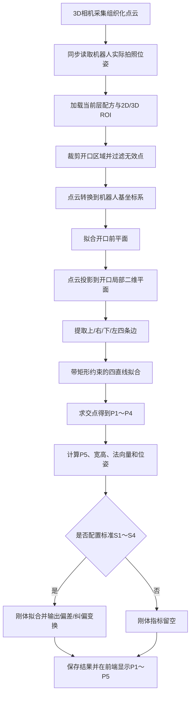

# 3D料架四角点定位算法改造开发文档

## 1. 文档信息

| 项目 | 内容 |
|---|---|
| 文档名称 | 3D料架四角点定位算法改造开发文档 |
| 适用系统 | AutomaticOrder 3D料架定位模块 |
| 改造对象 | 第一层及其他层的规则矩形开口定位 |
| 当前算法 | 单个ROI内有效点云的X/Y/Z分别取中位数 |
| 目标算法 | 矩形开口四边拟合、四角点重建、中心点计算、矩形位姿与偏差计算 |
| 输出坐标系 | 机器人基坐标系 `robot_base` |
| 算法版本建议 | `RECTANGLE_CORNERS_V2` |
| 文档状态 | 开发设计稿 |

本文只描述开发改造方案，不代表现有代码已经完成相应改造。

---

## 2. 改造背景

当前料架定位工作台在ROI内获取有效点云后，分别计算X、Y、Z的中位数：

```text
actual_x = median(points[:, 0])
actual_y = median(points[:, 1])
actual_z = median(points[:, 2])
```

该计算可以得到ROI点云的统计代表值，但存在以下问题：

1. 三轴中位数组合不一定对应点云中的真实物理点。
2. X/Y结果容易受到ROI位置、ROI大小、点云密度和遮挡影响。
3. 中位数不是矩形的几何中心，也不是料架的物理基准点。
4. 机器人无法直接通过触碰一个“统计点”验证料架开口位置。
5. 结果只能表达平移，无法可靠表达开口倾斜和旋转。
6. ROI轻微重画可能导致X/Y变化，但料架实际上没有移动。

本次改造不再把“ROI内所有点的中位数”作为正式料架位置，而是检测料架每层正面矩形开口的四条物理边，计算四个物理角点和一个派生中心点。

> 2026-07-22实施修订：P1～P5必须能够仅依靠“组织化点云 + 用户绘制ROI”自动提取。标准S1～S4不是角点检测的输入前提，只是可选的尺寸公差、刚体偏差和机器人验收基准。没有S1～S4时仍返回P1～P5，但刚体拟合类指标返回空值。

---

## 3. 改造目标

### 3.1 核心目标

针对每一层规则矩形开口，输出以下5个三维坐标：

```text
P1：左上角
P2：右上角
P3：右下角
P4：左下角
P5：矩形中心，P5 = (P1 + P2 + P3 + P4) / 4
```

P1～P4必须来源于料架实体开口的四条边拟合结果，不得使用前端手动画出的ROI矩形四角代替。

P5是派生点，不是第5个独立测量点。P5由后端根据P1～P4重新计算，前端不能自行提交P5作为可信测量值。

### 3.2 扩展目标

除5个坐标外，系统还应输出：

- 矩形宽度和高度；
- 开口局部X轴、Z轴和向外法向量；
- 开口中心位姿；
- `Rx/Ry/Rz`或完整旋转矩阵；
- 四边拟合误差；
- 矩形约束误差；
- 每个角点置信度；
- 标准矩形与实测矩形之间的刚体偏差；
- 用于机器人纠偏的逆变换；
- 算法版本、数据源和坐标系。

### 3.3 非目标

本次改造不包含以下内容：

- 不直接控制机器人高速运动；
- 不允许机器人无接触检测能力时自动撞击角点；
- 不使用P5作为实体接触点；
- 不以模拟点云作为现场验收数据；
- 不在矩形检测失败时静默回退到中位数并返回定位成功。

---

## 4. 物理对象和点位定义

### 4.1 默认物理对象

本文默认定位对象是“机器人正对料架时看到的每层矩形开口”，而不是水平层板顶面的整块矩形。

```text
机器人/相机位于料架正面

P1 左上角 ---------------- P2 右上角
    |                          |
    |           P5             |
    |         开口中心          |
    |                          |
P4 左下角 ---------------- P3 右下角
```

如果现场最终确认定位对象是水平层板顶面，则点位映射调整为：

```text
P1：前左
P2：前右
P3：后右
P4：后左
P5：层板中心
```

算法数学结构不变，但开口法向量、机器人接近方向和角点排序规则必须随之调整。

### 4.2 点位命名规则

点位顺序必须固定为：

```text
P1 = TOP_LEFT
P2 = TOP_RIGHT
P3 = BOTTOM_RIGHT
P4 = BOTTOM_LEFT
P5 = CENTER_DERIVED
```

不能依赖相机图像旋转后的屏幕上下左右长期确定点号。正式点号应由标准矩形的局部坐标轴确定：

- 标准局部X轴：`S1 → S2`，指向开口右侧；
- 标准局部Z轴：`S4 → S1`，指向开口上方；
- 向外法向量：从料架内部指向机器人/相机一侧；
- 插入方向：向外法向量的反方向。

### 4.3 标准点与实测点

为避免数据含义混乱，使用不同字母表示标准点与视觉实测点：

```text
S1～S4：机器人示教或精密测量得到的标准四角点
S5：标准中心，S5 = (S1 + S2 + S3 + S4) / 4

P1～P4：本次视觉检测得到的实测四角点
P5：实测中心，P5 = (P1 + P2 + P3 + P4) / 4

Q1～Q4：机器人TCP验证时实际探测得到的四角点
Q5：机器人验证中心，Q5 = (Q1 + Q2 + Q3 + Q4) / 4
```

---

## 5. 总体技术方案

### 5.1 目标数据流



### 5.2 核心原则

1. ROI只负责缩小搜索范围，不负责定义角点。
2. 四角点由实体四边的拟合交点产生。
3. 先检测物理几何，再计算中心，不能直接统计所有点的中心。
4. 标准数据和实测数据必须处于同一个机器人基坐标系。
5. 正式模式必须使用真实相机数据和有效手眼矩阵。
6. 机器人位姿应与点云帧同步获取，不能只依赖过期的配方拍照位姿。
7. 几何质量不合格时必须定位NG，不允许输出伪造的四角点。
8. 保留旧接口字段，确保PLC和历史页面可以平滑迁移。

---

## 6. 矩形四角点算法设计

### 6.1 输入数据

算法输入建议定义为：

```python
RectangleOpeningInput(
    organized_pointcloud,       # H x W x 3，相机坐标系点云
    pixel_roi,                  # 前端/配方保存的2D搜索ROI
    roi_3d,                     # 可选3D搜索范围
    T_flange_camera,            # 手眼矩阵
    T_base_flange,              # 本帧对应的机器人实际位姿
    standard_geometry=None,     # 可选；S1～S4只用于提取后的偏差评估
    thresholds,                 # 拟合与验收阈值
    frame_timestamp,
    robot_pose_timestamp,
)
```

正式模式前置校验：

- 点云不能为空；
- 数据源必须为真实相机；
- 手眼矩阵必须有效；
- 机器人实际位姿必须有效；
- 点云时间与机器人位姿时间差不得超过配置阈值；
- 当前层配方和ROI必须存在；
- 坐标单位必须统一为毫米。

如果要输出相对标准开口的旋转、刚体拟合残差和尺寸合格判定，则额外要求标准S1～S4存在；该要求不得阻止ROI自动提取实测P1～P5。

任何前置条件不满足时，返回明确错误，不进行中位数回退。

### 6.2 ROI裁剪

优先使用组织化点云和2D像素ROI裁剪：

```python
points_camera = organized_pointcloud[y:y+h, x:x+w].reshape(-1, 3)
```

过滤条件至少包括：

- 非NaN、非Inf；
- Z不为0；
- 距离范围合理；
- 相机SDK无效点标识过滤；
- 可选统计离群点过滤；
- 可选体素下采样。

3D ROI只能在明确知道其坐标系时使用：

- `CAMERA`坐标ROI：在手眼转换前裁剪；
- `ROBOT`坐标ROI：在手眼转换后裁剪；
- 坐标系缺失时禁止猜测。

### 6.3 坐标转换

正式计算统一使用：

```text
P_base = T_base_flange × T_flange_camera × P_camera
```

其中：

- `T_flange_camera`：相机坐标到机器人法兰坐标的变换；
- `T_base_flange`：机器人法兰坐标到机器人基坐标的变换；
- `P_camera`：相机坐标系点；
- `P_base`：机器人基坐标系点。

结果中必须记录：

```json
{
  "coordinate_system": "robot_base",
  "point_unit": "mm",
  "hand_eye_calibration_id": 12,
  "robot_pose_source": "live",
  "frame_timestamp": "...",
  "robot_pose_timestamp": "..."
}
```

### 6.4 开口前平面拟合

在裁剪点云中使用RANSAC拟合料架开口前框所在平面：

```text
n · p + d = 0
```

输出：

- 平面法向量 `n`；
- 平面常数 `d`；
- 内点集合；
- 平面RMSE；
- 内点比例。

法向量方向统一为“从料架内部指向机器人/相机”的向外方向 `normal_out`。如果RANSAC得到相反方向，应根据相机位置或标准法向量翻转。

若料架前框的四条边不完全共面，应采用以下顺序处理：

1. 分别拟合四边附近的局部表面；
2. 取标准开口法向量作为主方向；
3. 将四条物理边投影到统一的参考开口平面；
4. 在参考平面内完成矩形拟合。

### 6.5 建立开口局部二维坐标系

在开口平面内建立局部坐标：

- `u`：开口左到右方向；
- `v`：开口下到上方向；
- `n`：开口向外法向量。

优先使用标准矩形方向初始化：

```text
u_standard = normalize(S2 - S1)
v_standard = normalize(S1 - S4)
n_standard = normalize(u_standard × v_standard)
```

将三维点投影到二维开口平面：

```text
u_i = dot(P_i - O, u_axis)
v_i = dot(P_i - O, v_axis)
```

其中 `O` 为平面上的参考点。

这样可以在二维平面中稳定检测矩形四边，再把交点转换回三维。

### 6.6 四条边提取

推荐使用“深度/几何边缘 + RANSAC直线拟合”组合方案：

1. 在ROI内计算深度梯度和点云法向量变化；
2. 提取可能属于开口边界的候选点；
3. 根据局部 `u/v` 方向把候选点分为上、右、下、左四组；
4. 每组分别使用RANSAC拟合直线；
5. 使用标准宽高和标准方向消除错误边线。

四条边建议定义为：

```text
L_top
L_right
L_bottom
L_left
```

不得直接使用点云的 `min/max` 作为边界，因为单个离群点会严重改变结果。

### 6.7 矩形约束拟合

独立拟合四条直线后，进行带矩形约束的联合优化。约束包括：

```text
L_top ∥ L_bottom
L_left ∥ L_right
L_top ⟂ L_left
上边长度 ≈ 下边长度
左边长度 ≈ 右边长度
矩形宽度 ≈ 配方标准宽度
矩形高度 ≈ 配方标准高度
```

推荐优化目标：

```text
最小化：
  边缘点到对应直线的距离平方和
+ 平行约束惩罚
+ 垂直约束惩罚
+ 宽高偏差惩罚
+ 相对标准位姿的合理范围惩罚
```

可以使用SciPy最小二乘优化，也可以先用RANSAC获得初值，再做一次确定性的约束优化。

### 6.8 四角点计算

在二维开口平面中计算四条边交点：

```text
p1_2d = intersection(L_top,    L_left)
p2_2d = intersection(L_top,    L_right)
p3_2d = intersection(L_bottom, L_right)
p4_2d = intersection(L_bottom, L_left)
```

再转换回三维机器人基坐标：

```text
P = O + u * u_axis + v * v_axis
```

得到：

```text
P1、P2、P3、P4
```

角点不是从原始点云中挑选“最近点”，而是两条拟合边线的几何交点。因此角点可以位于没有直接深度采样的物理尖角位置。

### 6.9 中心点P5

中心点必须由后端计算：

```text
P5 = (P1 + P2 + P3 + P4) / 4
```

矩形条件良好时，也可以用两条对角线交点交叉校验：

```text
C13 = midpoint(P1, P3)
C24 = midpoint(P2, P4)
center_consistency_error = distance(C13, C24)
```

若两个对角线中点差异超过阈值，矩形拟合应判定为NG。

### 6.10 宽度、高度和局部轴

使用四角点平均计算宽高：

```text
width_top    = |P2 - P1|
width_bottom = |P3 - P4|
width        = (width_top + width_bottom) / 2

height_left  = |P1 - P4|
height_right = |P2 - P3|
height       = (height_left + height_right) / 2
```

局部轴建议计算为：

```text
x_axis_raw = ((P2 - P1) + (P3 - P4)) / 2
z_axis_raw = ((P1 - P4) + (P2 - P3)) / 2

x_axis = normalize(x_axis_raw)
z_axis = normalize(z_axis_raw - dot(z_axis_raw, x_axis) * x_axis)
normal_out = normalize(x_axis × z_axis)
```

如果 `normal_out` 与标准向外法向量方向相反，则整体翻转法向量，避免机器人接近方向反向。

### 6.11 矩形位姿

以P5为矩形位姿原点，使用局部轴构建旋转矩阵：

```text
T_base_opening = [R_base_opening, P5]
```

旋转矩阵列向量顺序必须与项目机器人坐标定义统一。建议明确为：

```text
X轴：开口左到右
Y轴：从开口向料架内部
Z轴：开口下到上
```

由于 `normal_out` 指向机器人，内部方向为：

```text
y_axis_in = -normal_out
```

最终：

```text
R_base_opening = [x_axis, y_axis_in, z_axis]
```

构造后必须验证：

- `R × Rᵀ ≈ I`；
- `det(R) ≈ 1`；
- 三轴方向与标准开口一致；
- 无镜像和法向量翻转。

---

## 7. 标准四点与实测四点的偏差拟合

### 7.1 为什么不能只比较P5

仅比较中心点只能检测平移，无法判断料架是否发生旋转。两个矩形可能中心相同，但角度不同，机器人仍可能在开口边缘发生碰撞。

因此正式定位必须使用四组对应点：

```text
S1 ↔ P1
S2 ↔ P2
S3 ↔ P3
S4 ↔ P4
```

### 7.2 Kabsch/SVD刚体拟合

求解从标准矩形到实测矩形的刚体变换：

```text
P_actual ≈ R_delta × S_standard + t_delta
```

目标函数：

```text
min Σ ||P_i - (R_delta × S_i + t_delta)||²
```

推荐使用Kabsch算法：

1. 计算标准中心 `S5`；
2. 计算实测中心 `P5`；
3. 标准点与实测点分别去中心化；
4. 计算协方差矩阵；
5. SVD分解；
6. 构造无镜像旋转矩阵；
7. 计算平移向量。

伪代码：

```python
S = np.asarray([S1, S2, S3, S4], dtype=float)
P = np.asarray([P1, P2, P3, P4], dtype=float)

S5 = S.mean(axis=0)
P5 = P.mean(axis=0)

S0 = S - S5
P0 = P - P5

H = S0.T @ P0
U, _, Vt = np.linalg.svd(H)
R = Vt.T @ U.T

if np.linalg.det(R) < 0:
    Vt[-1, :] *= -1
    R = Vt.T @ U.T

t = P5 - R @ S5
```

### 7.3 同时保存偏差变换和纠偏变换

为避免PLC或机器人补偿方向理解错误，结果中必须同时保存两套变换：

```text
T_standard_to_actual：标准位置 → 当前实测位置
T_actual_to_standard：当前实测位置 → 标准位置
```

两者关系：

```text
T_actual_to_standard = inverse(T_standard_to_actual)
```

定义建议：

- `deviation_transform`：描述料架偏到哪里；
- `correction_transform`：描述机器人或目标需要如何纠正回来。

现有兼容字段建议继续定义为：

```text
actual_x/y/z = P5.x/y/z
standard_x/y/z = S5.x/y/z
offset_x/y/z = P5 - S5
offset_rz = R_delta对应的Z轴旋转角
```

完整旋转和平移矩阵保存在 `result_data` 中。PLC究竟使用 `deviation` 还是 `correction`，必须通过现场已知位移试验确认，不能只凭字段名称推断。

### 7.4 四点拟合残差

拟合完成后计算每个角点残差：

```text
e_i = ||P_i - (R_delta × S_i + t_delta)||
```

保存：

- `corner_residuals_mm`；
- `mean_corner_residual_mm`；
- `max_corner_residual_mm`；
- `rigid_fit_rmse_mm`。

残差过大通常表示：

- 角点顺序错误；
- 检测到错误边缘；
- 点云噪声过大；
- 料架实际不是标准矩形；
- 某个角点被遮挡；
- 坐标变换使用了错误机器人位姿。

---

## 8. 质量判定与置信度

### 8.1 不再只按点数计算置信度

当前部分路径使用点数估算置信度。改造后置信度应综合以下指标：

- 有效点数量；
- 开口前平面内点比例；
- 平面RMSE；
- 四条边各自的内点数；
- 四条边拟合RMSE；
- 平行度误差；
- 垂直度误差；
- 对角线一致性；
- 宽度和高度相对标准值的偏差；
- 四点刚体拟合残差；
- 遮挡比例；
- 坐标转换链是否完整。

建议每项先归一化为0～1，再按权重组合：

```text
confidence =
    w_plane    × score_plane
  + w_edges    × score_edges
  + w_rectangle× score_rectangle
  + w_size     × score_size
  + w_rigid    × score_rigid_fit
```

任何硬性安全条件失败时，即使综合分较高也必须定位NG。

### 8.2 建议初始阈值

以下数值仅作为调试初值，最终必须根据相机精度、拍摄距离和装箱工艺确认：

| 指标 | 建议初值 |
|---|---:|
| 每条边最少有效点 | 30 |
| 开口平面最少内点 | 200 |
| 平面RMSE | ≤ 2.0 mm |
| 边线RMSE | ≤ 2.0 mm |
| 上下边平行误差 | ≤ 2.0° |
| 左右边平行误差 | ≤ 2.0° |
| 相邻边垂直误差 | ≤ 3.0° |
| 对角线中点一致性 | ≤ 2.0 mm |
| 宽度相对标准偏差 | ≤ 工艺配置值 |
| 高度相对标准偏差 | ≤ 工艺配置值 |
| 四角点刚体拟合最大残差 | ≤ 3.0 mm |
| 最低综合置信度 | 沿用配方 `confidence_threshold`，默认0.70 |

### 8.3 错误码建议

```text
REAL_CAMERA_REQUIRED
HAND_EYE_INVALID
ROBOT_POSE_MISSING
ROBOT_POSE_STALE
ROI_NOT_CONFIGURED
INSUFFICIENT_POINTS
OPENING_PLANE_NOT_FOUND
TOP_EDGE_NOT_FOUND
RIGHT_EDGE_NOT_FOUND
BOTTOM_EDGE_NOT_FOUND
LEFT_EDGE_NOT_FOUND
RECTANGLE_CONSTRAINT_FAILED
CORNER_ORDER_INVALID
CORNER_CONFIDENCE_LOW
RECTANGLE_SIZE_OUT_OF_TOLERANCE
RIGID_FIT_RESIDUAL_TOO_HIGH
COORDINATE_SYSTEM_INVALID
REFERENCE_GEOMETRY_NOT_CONFIGURED
```

生产模式不得捕获这些错误后返回中位数定位成功。

---

## 9. 数据结构设计

### 9.1 配方标准几何数据（可选校验基准）

现有 `RackLocationRecipe.reference_feature_config` 已经是JSON字段，建议第一阶段复用该字段，避免新增数据库列。

建议结构：

```json
{
  "algorithm_version": "RECTANGLE_CORNERS_V2",
  "opening_rectangle": {
    "point_order": ["P1_TOP_LEFT", "P2_TOP_RIGHT", "P3_BOTTOM_RIGHT", "P4_BOTTOM_LEFT"],
    "coordinate_system": "robot_base",
    "point_unit": "mm",
    "standard_points": {
      "p1": {"x": 900.0, "y": 500.0, "z": 1200.0},
      "p2": {"x": 1500.0, "y": 500.0, "z": 1200.0},
      "p3": {"x": 1500.0, "y": 500.0, "z": 800.0},
      "p4": {"x": 900.0, "y": 500.0, "z": 800.0}
    },
    "standard_center": {"x": 1200.0, "y": 500.0, "z": 1000.0},
    "standard_axes": {
      "x_axis": [1.0, 0.0, 0.0],
      "y_axis_in": [0.0, 1.0, 0.0],
      "z_axis": [0.0, 0.0, 1.0],
      "normal_out": [0.0, -1.0, 0.0]
    },
    "standard_width_mm": 600.0,
    "standard_height_mm": 400.0,
    "thresholds": {
      "plane_rmse_mm": 2.0,
      "edge_rmse_mm": 2.0,
      "parallel_angle_deg": 2.0,
      "perpendicular_angle_deg": 3.0,
      "center_consistency_mm": 2.0,
      "rigid_fit_max_residual_mm": 3.0
    }
  }
}
```

用户选择保存标准校验四点时，后端必须：

1. 校验四点是否完整；
2. 校验四点顺序；
3. 重新计算标准中心S5；
4. 重新计算标准宽高和局部轴；
5. 不信任前端提交的中心、宽高和旋转矩阵；
6. 将S5同步写入现有 `standard_x/y/z`，保持旧接口兼容。

### 9.2 定位结果数据

建议把本次完整结果保存在 `RackLocationResult.result_data.opening_rectangle`：

```json
{
  "algorithm_version": "RECTANGLE_CORNERS_V2",
  "coordinate_system": "robot_base",
  "point_unit": "mm",
  "points": {
    "p1": {"x": 901.2, "y": 501.0, "z": 1200.8, "confidence": 0.96},
    "p2": {"x": 1501.1, "y": 501.5, "z": 1201.0, "confidence": 0.95},
    "p3": {"x": 1501.0, "y": 500.9, "z": 801.2, "confidence": 0.94},
    "p4": {"x": 901.0, "y": 500.7, "z": 801.0, "confidence": 0.95}
  },
  "center": {
    "point_id": "P5",
    "source": "derived_from_p1_p4",
    "x": 1201.075,
    "y": 501.025,
    "z": 1001.0
  },
  "geometry": {
    "width_mm": 599.95,
    "height_mm": 399.8,
    "x_axis": [0.9999, 0.01, 0.0],
    "y_axis_in": [0.01, -0.9999, 0.0],
    "z_axis": [0.0, 0.0, 1.0],
    "normal_out": [-0.01, 0.9999, 0.0]
  },
  "pose": {
    "x": 1201.075,
    "y": 501.025,
    "z": 1001.0,
    "rx": 0.0,
    "ry": 0.0,
    "rz": 0.57,
    "matrix": [[1, 0, 0, 1201.075], [0, 1, 0, 501.025], [0, 0, 1, 1001.0], [0, 0, 0, 1]]
  },
  "quality": {
    "valid_point_count": 8320,
    "plane_rmse_mm": 0.72,
    "edge_rmse_mm": {"top": 0.8, "right": 0.9, "bottom": 0.7, "left": 0.8},
    "parallel_error_deg": 0.4,
    "perpendicular_error_deg": 0.6,
    "center_consistency_mm": 0.3,
    "rigid_fit_rmse_mm": 0.9,
    "max_corner_residual_mm": 1.2,
    "confidence": 0.95
  },
  "deviation_transform": {
    "meaning": "standard_to_actual",
    "matrix": [[1, 0, 0, 1.075], [0, 1, 0, 1.025], [0, 0, 1, 1.0], [0, 0, 0, 1]]
  },
  "correction_transform": {
    "meaning": "actual_to_standard",
    "matrix": [[1, 0, 0, -1.075], [0, 1, 0, -1.025], [0, 0, 1, -1.0], [0, 0, 0, 1]]
  }
}
```

### 9.3 现有字段兼容规则

| 现有字段 | V2含义 |
|---|---|
| `actual_x` | P5.x |
| `actual_y` | P5.y |
| `actual_z` | P5.z |
| `standard_x` | S5.x |
| `standard_y` | S5.y |
| `standard_z` | S5.z |
| `offset_x` | P5.x - S5.x |
| `offset_y` | P5.y - S5.y |
| `offset_z` | P5.z - S5.z |
| `offset_rz` | 标准矩形到实测矩形的Z轴角度偏差 |
| `confidence` | 矩形综合几何置信度 |
| `is_success` | 所有硬性条件和综合置信度均通过 |

这样现有PLC、历史记录和结果列表仍可以继续读取中心点和平移偏差，新增客户端则读取完整四角点和矩阵。

---

## 10. API改造设计

### 10.1 计算接口

当前工作台计算接口保持不变：

```text
POST /vision/api/rack-location/workbench/calculate/
```

请求新增或明确：

```json
{
  "recipe_id": 1,
  "layer_no": 1,
  "pointcloud_token": "...",
  "algorithm_version": "RECTANGLE_CORNERS_V2",
  "roi_config": {
    "target_roi": {"x": 100, "y": 80, "w": 420, "h": 320}
  },
  "save_record": true
}
```

响应在保留原字段基础上新增：

```json
{
  "success": true,
  "result": {
    "locate_ok": true,
    "actual_x": 1201.075,
    "actual_y": 501.025,
    "actual_z": 1001.0,
    "offset_x": 1.075,
    "offset_y": 1.025,
    "offset_z": 1.0,
    "offset_rz": 0.57,
    "confidence": 0.95,
    "opening_rectangle": {
      "points": {
        "p1": {"x": 901.2, "y": 501.0, "z": 1200.8, "confidence": 0.96},
        "p2": {"x": 1501.1, "y": 501.5, "z": 1201.0, "confidence": 0.95},
        "p3": {"x": 1501.0, "y": 500.9, "z": 801.2, "confidence": 0.94},
        "p4": {"x": 901.0, "y": 500.7, "z": 801.0, "confidence": 0.95}
      },
      "center": {"x": 1201.075, "y": 501.025, "z": 1001.0, "source": "derived"},
      "geometry": {},
      "pose": {},
      "quality": {}
    }
  }
}
```

为减少响应重复，可以让 `opening_rectangle` 同时存在于顶层结果和 `result_data` 中，但后端必须保证两者来自同一个对象，不能分别计算。

### 10.2 配方接口

现有配方接口已经返回 `reference_feature_config`，无需新增路由。需要补充服务端校验，并允许保存标准四点。

### 10.3 机器人验证接口建议

新增结果验证接口：

```text
POST /vision/api/rack-location/results/{result_id}/tcp-verification/
```

请求：

```json
{
  "coordinate_system": "robot_base",
  "measured_points": {
    "q1": {"x": 901.8, "y": 501.2, "z": 1201.1},
    "q2": {"x": 1501.5, "y": 501.7, "z": 1201.4},
    "q3": {"x": 1501.4, "y": 501.1, "z": 801.6},
    "q4": {"x": 901.5, "y": 500.9, "z": 801.4}
  },
  "tcp_name": "VERIFY_PROBE_01",
  "operator": "operator_name",
  "notes": "第一层低速探测验证"
}
```

后端计算：

```text
Q5 = (Q1 + Q2 + Q3 + Q4) / 4
角点误差 Ei = Qi - Pi
角点距离误差 |Ei|
中心误差 E5 = Q5 - P5
最大角点误差
平均角点误差
验证是否通过
```

验证结果保存在 `RackLocationResult.result_data.tcp_verification`。如果后续需要审计多次验证，再新增独立验证记录模型。

### 10.4 结果查询接口

历史结果查询必须返回：

- P1～P5；
- 矩形宽高和姿态；
- 拟合质量；
- 算法版本；
- TCP验证状态；
- 标准到实测偏差变换；
- 实测到标准纠偏变换。

---

## 11. 后端代码改造建议

### 11.1 新增独立算法模块

建议新增：

```text
apps/vision/algorithms/rack_opening_rectangle.py
```

不要继续把所有算法堆叠在 `rack_location.py` 中。

建议类型：

```python
@dataclass
class Point3DResult:
    point_id: str
    x: float
    y: float
    z: float
    confidence: float
    source: str


@dataclass
class RectangleQuality:
    plane_rmse_mm: float
    edge_rmse_mm: dict
    parallel_error_deg: float
    perpendicular_error_deg: float
    center_consistency_mm: float
    rigid_fit_rmse_mm: float
    max_corner_residual_mm: float
    confidence: float


@dataclass
class RackOpeningRectangleResult:
    p1: Point3DResult
    p2: Point3DResult
    p3: Point3DResult
    p4: Point3DResult
    p5: Point3DResult
    width_mm: float
    height_mm: float
    x_axis: np.ndarray
    y_axis_in: np.ndarray
    z_axis: np.ndarray
    normal_out: np.ndarray
    pose_matrix: np.ndarray
    deviation_transform: np.ndarray
    correction_transform: np.ndarray
    quality: RectangleQuality
    is_success: bool
    error_code: str = ''
    error_message: str = ''
```

建议服务方法：

```python
class RackOpeningRectangleLocator:
    def locate(...): ...
    def fit_opening_plane(...): ...
    def build_local_frame(...): ...
    def extract_edge_candidates(...): ...
    def fit_four_edges(...): ...
    def refine_rectangle(...): ...
    def calculate_corners(...): ...
    def order_corners(...): ...
    def calculate_geometry(...): ...
    def fit_rigid_transform(...): ...
    def evaluate_quality(...): ...
```

### 11.2 统一工作台和正式定位算法

当前项目存在工作台路径和 `rack_3d` 模块路径。改造后，两条路径必须调用同一个 `RackOpeningRectangleLocator`，避免出现：

- 工作台显示四角点；
- 正式生产仍使用中位数；
- 离线测试和正式结果不一致。

建议：

```text
RackLocationService.calculate_workbench()
Rack3DLocator.test_locate()
Rack3DLocator.locate()
rack_3d.RackPositioningService.execute_positioning()
```

最终都进入统一矩形定位服务或共享核心算法函数。

### 11.3 旧中位数算法处理

`calculate_median_xyz()` 可以保留用于：

- 调试统计；
- 点云可视化中心；
- 历史离线数据对比；
- `MEDIAN_V1`兼容模式。

但生产配方选择 `RECTANGLE_CORNERS_V2` 后：

- 不得使用中位数作为P5；
- 不得在四角点失败时回退中位数并标记成功；
- 必须返回明确失败原因。

### 11.4 结果图改造

在结果图上绘制：

- P1～P4彩色圆点；
- P1-P2-P3-P4-P1矩形连线；
- P5中心十字；
- 点号标签；
- 坐标值；
- 向外法向量箭头；
- 宽度和高度；
- 定位OK/NG；
- 拟合置信度和最大残差。

推荐颜色：

| 元素 | 颜色 |
|---|---|
| P1 | 红色 |
| P2 | 黄色 |
| P3 | 青色 |
| P4 | 紫色 |
| P5 | 绿色十字 |
| 矩形边 | 绿色（OK）/红色（NG） |
| 法向量 | 蓝色箭头 |

---

## 12. 前端页面改造

### 12.1 改造文件

主要修改：

```text
templates/vision/rack_locator_panel.html
static/vision/js/rack_locator_workbench.js
```

结果详情区域在现有“标准值/实测值/有效点数”下方新增“五点坐标”卡片。

### 12.2 五点坐标表格

建议页面结构：

| 点位 | 含义 | X(mm) | Y(mm) | Z(mm) | 置信度 | 来源 |
|---|---|---:|---:|---:|---:|---|
| P1 | 左上角 |  |  |  |  | 四边拟合 |
| P2 | 右上角 |  |  |  |  | 四边拟合 |
| P3 | 右下角 |  |  |  |  | 四边拟合 |
| P4 | 左下角 |  |  |  |  | 四边拟合 |
| P5 | 矩形中心 |  |  |  |  | P1～P4派生 |

如果已配置标准四点，建议扩展为：

| 点位 | 标准坐标 | 视觉实测坐标 | ΔX | ΔY | ΔZ | 距离误差 |
|---|---|---|---:|---:|---:|---:|

P5行应显示“派生中心”徽章，避免操作员把它理解为独立检测到的物理点。

### 12.3 几何质量卡片

显示：

```text
宽度
高度
Rz角度
平面RMSE
四边最大RMSE
平行度误差
垂直度误差
最大角点残差
综合置信度
坐标系
数据源
算法版本
```

### 12.4 画布叠加

点云预览和结果图应显示：

- P1～P4位置；
- 四边连线；
- P5中心十字；
- 点号；
- 鼠标悬停时显示三维坐标；
- NG时高亮具体失败边，例如“左边缘未找到”。

前端画布坐标仅用于显示，P1～P5的三维值必须来自后端响应。

### 12.5 JavaScript渲染建议

在 `renderResult(r)` 中增加：

```javascript
const rectangle = r.opening_rectangle || r.result_data?.opening_rectangle;
renderCornerTable(rectangle);
renderRectangleQuality(rectangle?.quality);
renderRectangleOverlay(rectangle);
```

渲染前必须校验：

- `coordinate_system === 'robot_base'`；
- P1～P4完整；
- P5存在且标记为派生；
- 算法版本为预期版本；
- 结果不是模拟数据。

如果返回旧版结果，页面显示“历史中位数算法结果”，不要伪造P1～P5。

### 12.6 前端状态设计

建议状态：

```text
未计算
四边检测中
矩形拟合中
拟合成功
拟合NG
等待TCP验证
TCP验证通过
TCP验证失败
```

---

## 13. 机器人TCP验证设计

### 13.1 验证原则

机器人验证的目标是使用独立TCP测量结果验证视觉四角点，不是让机器人直接高速执行视觉坐标。

必须满足：

- 使用经过标定的验证测头TCP；
- 手动或验证模式；
- 低速运行；
- 有碰撞检测、力控、探针输入或人工点动；
- 无产品和无干涉物；
- 每个点先到安全接近点；
- 验证过程保留操作员、时间和测头信息。

### 13.2 P1～P4验证

推荐不要直接撞击尖锐角点。矩形角点是两条边的数学交点，实际可能存在圆角、焊缝或倒角。

推荐两种方式：

#### 方式A：触碰相邻两条边并求交点

针对每个角，分别探测相邻水平边和垂直边，通过机器人触点拟合两条边，再求交点得到Q1～Q4。

该方式最符合视觉算法定义，也不会依赖实体角是否尖锐。

#### 方式B：安装专用角点验证治具

在四角安装可重复定位的锥孔、球窝或标定销，机器人使用触碰测头获取中心。

该方式重复性更好，但需要现场增加验证工装。

### 13.3 安全接近点

定义 `normal_out` 为从料架内部指向机器人方向。

每个角点的安全接近点：

```text
A_i = P_i + normal_out × approach_distance
```

建议初始安全距离：

```text
approach_distance = 50 mm
```

运动顺序：

```text
当前安全位
→ A_i（角点外侧50mm）
→ 角点外侧5mm
→ 低速探测相邻边/验证治具
→ 记录Q_i
→ 退回A_i
```

安全距离必须根据现场工具长度和障碍物重新确认。

### 13.4 P5验证

P5通常位于开口中心的空中，不是实体接触点，因此不直接触碰P5。

机器人根据Q1～Q4计算：

```text
Q5 = (Q1 + Q2 + Q3 + Q4) / 4
```

再比较：

```text
E5 = Q5 - P5
center_distance_error = ||E5||
```

机器人可以移动到P5外侧的安全观察点，人工观察是否正对开口中心，但这只能作为辅助检查，不能替代Q5数值验证。

### 13.5 验证结果

每次验证保存：

```text
P1～P5：视觉值
Q1～Q5：机器人值
每点ΔX/ΔY/ΔZ
每点三维距离误差
平均误差
最大误差
中心误差
TCP名称
操作员
验证时间
验证是否通过
```

### 13.6 验证通过标准

通过标准必须来自装箱工艺公差。建议满足：

```text
max(|Qi - Pi|) ≤ 角点允许误差
|Q5 - P5| ≤ 中心允许误差
重复验证标准差 ≤ 重复性阈值
```

不得只按平均误差通过，因为单个角点误差过大可能导致机器人碰撞。

---

## 14. 标定标准四点流程

首次建立配方时，推荐流程：

1. 料架放到机械标准位并可靠夹紧；
2. 激活已经通过独立真值验证的手眼标定；
3. 使用机器人验证测头低速测量四个标准角点；
4. 得到S1～S4；
5. 后端计算S5、标准宽高、标准局部轴和标准位姿；
6. 保存到 `reference_feature_config.opening_rectangle`；
7. 同步S5到 `standard_x/y/z`；
8. 采集真实点云并运行视觉四角点检测；
9. 比较P1～P5与S1～S5；
10. 验证通过后才能启用该层配方。

标准点建立后，前端编辑时应有明确的“重新示教标准四点”操作，不允许普通参数保存意外覆盖标准点。

---

## 15. 测试方案

### 15.1 单元测试

新增测试建议：

```text
apps/vision/tests/test_rack_opening_rectangle.py
```

至少覆盖：

1. 理想矩形点云能恢复P1～P5；
2. 添加高斯噪声后角点误差在阈值内；
3. 添加离群点后RANSAC仍能稳定拟合；
4. 四角点输入顺序变化后能正确重排；
5. 矩形平移后能恢复正确ΔX/ΔY/ΔZ；
6. 矩形旋转后能恢复正确Rz；
7. 小范围Rx/Ry倾斜后能恢复完整法向量；
8. 某条边缺失时返回明确错误；
9. 宽高不符合标准时定位NG；
10. 对角线不一致时定位NG；
11. P5始终由P1～P4后端计算；
12. Kabsch拟合不产生镜像矩阵；
13. `deviation_transform`与`correction_transform`互为逆；
14. 旧接口字段正确映射到P5；
15. 生产模式禁止回退中位数。

### 15.2 API集成测试

覆盖：

- 工作台计算接口返回P1～P5；
- 结果保存后查询仍返回相同数据；
- `actual_x/y/z`等于P5；
- 旧客户端不读取新字段时仍可正常工作；
- 标准四点缺失时仍返回自动提取的P1～P5，且刚体拟合指标为`null`；
- 模拟数据不能作为生产定位成功结果；
- 坐标系不是 `robot_base` 时定位NG；
- TCP验证接口正确计算Q5和误差。

### 15.3 前端测试

覆盖：

- P1～P5五行均正确显示；
- P5显示“派生中心”；
- 坐标保留统一小数位；
- 旧结果显示兼容提示；
- NG结果显示具体失败边；
- 画布标签与表格点号一致；
- 切换层号后不残留上一层五点数据；
- 切换配方后标准点同步更新；
- 模拟数据有明显警告；
- TCP验证结果可以展开查看。

### 15.4 现场验证测试

每层至少执行：

1. 标准位置静态重复采集20次；
2. X方向已知位移 `+5/-5 mm`；
3. Y方向已知位移 `+5/-5 mm`；
4. Z方向已知位移 `+5/-5 mm`；
5. 小角度Rz旋转测试；
6. 遮挡一个角点测试；
7. 遮挡一条边测试；
8. 错误ROI测试；
9. 相机断开测试；
10. 机器人拍照位姿错误测试；
11. PLC只读/不动作验证；
12. 机器人低速TCP验证P1～P4并反算Q5。

---

## 16. 验收标准

最终数值由现场工艺确认，至少包括以下项目：

| 验收项 | 判定方式 |
|---|---|
| 四边检测完整性 | 上、右、下、左四边全部有效 |
| 点号一致性 | P1～P4顺序无交换 |
| 矩形几何 | 平行、垂直、宽高、对角线全部在阈值内 |
| 坐标系 | 必须为 `robot_base` |
| 数据源 | 生产验收必须为真实相机 |
| P1～P4准确性 | 与机器人Q1～Q4比较，最大误差在工艺阈值内 |
| P5准确性 | 与Q5比较，中心误差在工艺阈值内 |
| 重复性 | 20次采集的各点标准差满足工艺要求 |
| 已知位移响应 | 检测变化量与实际移动量一致，方向正确 |
| 旋转响应 | 检测Rz与实际旋转一致 |
| 纠偏方向 | 应用纠偏后剩余误差收敛，而不是扩大 |
| 异常保护 | 缺边、低置信度、坐标无效时不写PLC有效补偿 |

建议验收报告保留每次原始点云、结果图、P1～P5、Q1～Q5、配方版本、算法版本和标定ID。

---

## 17. 兼容与上线策略

### 17.1 双版本并行

配方增加算法版本配置：

```text
MEDIAN_V1
RECTANGLE_CORNERS_V2
```

上线初期：

- 历史配方保持 `MEDIAN_V1`；
- 新建测试配方使用 `RECTANGLE_CORNERS_V2`；
- 同一帧点云可离线运行两种算法对比；
- 只有V2通过现场验收后才切换生产配方；
- V2生产模式失败时返回NG，不自动回退V1。

### 17.2 数据兼容

- 数据库现有字段继续保留；
- 标准四点保存在 `reference_feature_config`；
- 实测五点保存在 `result_data`；
- `actual_x/y/z`映射为P5；
- 旧历史记录没有五点时，前端显示“旧版中位数结果”；
- 新增JSON结构必须带 `algorithm_version`。

### 17.3 回滚

回滚只允许通过明确切换配方算法版本完成，不允许运行时自动回退。回滚后：

- 保留V2原始点云和结果；
- 记录回滚原因；
- 禁止把V1结果显示成五点结果；
- PLC字段恢复旧算法前必须重新确认补偿方向和阈值。

---

## 18. 预计修改文件清单

| 文件 | 修改内容 |
|---|---|
| `apps/vision/algorithms/rack_opening_rectangle.py` | 新增矩形四边、四角点、中心、位姿、刚体拟合核心算法 |
| `apps/vision/rack_location.py` | 工作台和正式定位改为调用统一矩形算法；结果映射与持久化 |
| `apps/vision/rack_3d/services.py` | 与工作台共用矩形定位核心，避免两套结果不一致 |
| `apps/vision/views.py` | API请求解析、结果序列化、标准四点校验、TCP验证接口 |
| `apps/vision/models.py` | 第一阶段原则上不新增字段；复用JSON字段，必要时仅补充验证模型 |
| `apps/vision/algorithms/image_io.py` | 结果图绘制P1～P5、矩形边、法向量和质量信息 |
| `templates/vision/rack_locator_panel.html` | 新增五点坐标表、几何质量和TCP验证区域 |
| `static/vision/js/rack_locator_workbench.js` | 渲染五点、质量数据、画布叠加和版本兼容提示 |
| `apps/vision/tests/test_rack_opening_rectangle.py` | 新增算法单元测试 |
| `apps/vision/tests.py`或独立API测试文件 | 增加工作台、结果保存和验证接口测试 |

---

## 19. 推荐开发顺序

### 阶段1：数据契约

1. 定义P1～P5命名和JSON结构；
2. 定义标准四点保存结构；
3. 定义结果兼容字段；
4. 定义算法版本和错误码；
5. 编写数据结构单元测试。

### 阶段2：核心算法

1. 开口平面拟合；
2. 局部二维坐标系；
3. 四边候选点提取；
4. 四边RANSAC拟合；
5. 矩形约束优化；
6. P1～P4求交；
7. P5、宽高和位姿；
8. Kabsch偏差拟合；
9. 质量判定和错误码；
10. 合成数据测试。

### 阶段3：业务链路

1. 工作台接入新算法；
2. 正式定位接入同一算法；
3. 保存完整结果；
4. 保持旧字段兼容；
5. 禁止生产模式静默回退；
6. API集成测试。

### 阶段4：前端

1. 五点坐标表；
2. 矩形几何质量；
3. 点云图P1～P5叠加；
4. 旧版结果兼容；
5. TCP验证结果显示；
6. 前端交互测试。

### 阶段5：机器人验证与现场验收

1. TCP验证测头标定；
2. 标准四点S1～S4示教；
3. 视觉P1～P5重复性；
4. 机器人Q1～Q4验证；
5. Q5与P5比较；
6. 已知平移和旋转测试；
7. PLC补偿方向确认；
8. 低速闭环验证；
9. 安全异常测试；
10. 签署现场验收报告。

---

## 20. 开发前必须现场确认的问题

以下问题不影响文档设计，但开发进入机器人联调前必须确认：

1. “一层矩形”最终指正面开口还是水平层板顶面？
2. 机器人基坐标各轴的正方向是什么？
3. `normal_out`应指向相机还是机器人等待位？
4. 机器人插入方向与开口法向量的符号关系是什么？
5. PLC期望接收料架偏差还是机器人纠偏值？
6. 机器人是否支持触碰探针、力控或碰撞检测？
7. 实体角点是否有圆角、焊缝或遮挡？
8. 四个角是否都能被相机观察到？
9. 第一层开口的标准宽高和允许公差是多少？
10. 每个角点和中心允许的最大定位误差是多少？
11. 是否需要补偿Rx/Ry，还是只使用X/Y/Z/Rz？
12. 机器人实际拍照位姿能否随点云帧同步获取？

如果后侧或部分角点不可见，应优先调整相机位置或采用可见边线推断方案，不能用前端ROI角点冒充实体角点。

---

## 21. 最终设计结论

本次算法改造的核心不是“把中位数换成平均值”，而是把定位对象从“ROI点云统计值”改为“料架矩形开口的物理几何结构”。

最终正式结果应满足：

```text
实体四边
→ 拟合四条直线
→ 求得P1～P4
→ 计算派生中心P5
→ 计算矩形宽高和位姿
→ 与标准S1～S4进行刚体拟合
→ 得到料架偏差与机器人纠偏变换
→ 前端显示P1～P5和拟合质量
→ 机器人TCP低速验证P1～P4，反算Q5验证P5
```

P1～P4是可追溯的物理几何点，P5是稳定、可解释的几何中心。四点和中心同时保留，可以兼顾前端展示、算法诊断、机器人验证、偏差计算和后续PLC补偿。
